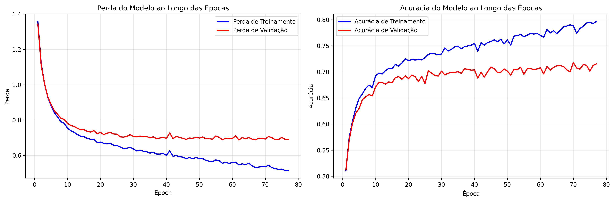
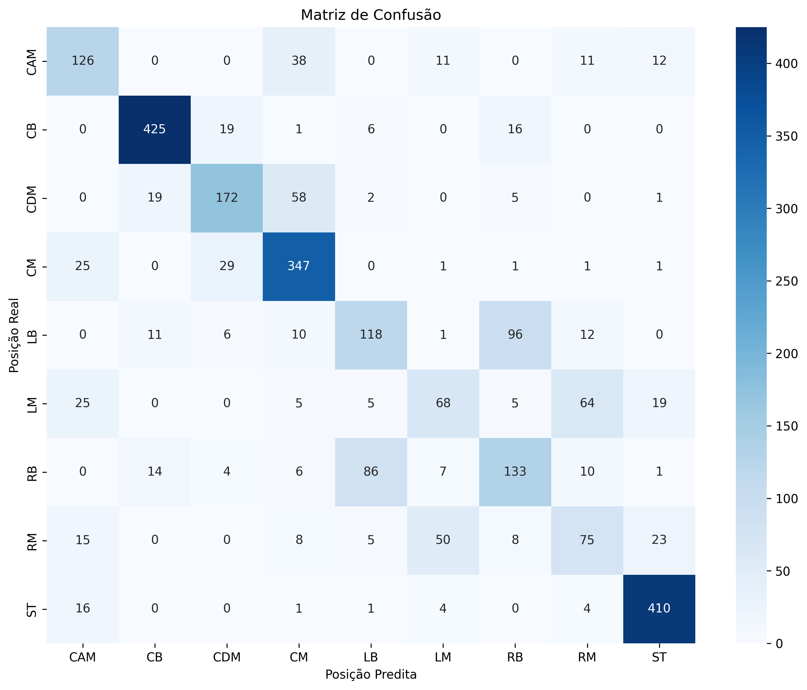
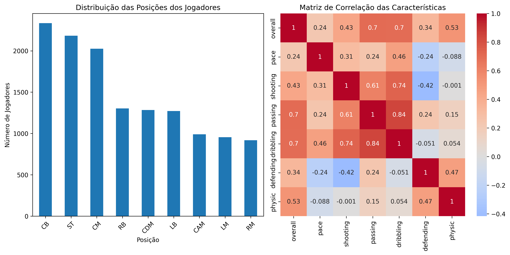
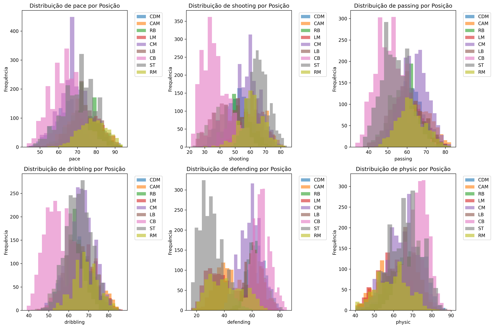

# Classificação de Posições de Jogadores EA FC 26 usando Perceptron Multi-Camadas

**Grupo:** Antonio, Ian e Luiz Guilherme

**Data:** 07/10/2025

**Projeto 1 - Classificação**

---

## Índice

1. [Seleção do Dataset](#1-selecao-do-dataset)
2. [Explicação do Dataset](#2-explicacao-do-dataset)
3. [Limpeza e Normalização de Dados](#3-limpeza-e-normalizacao-de-dados)
4. [Implementação do MLP](#4-implementacao-do-mlp)
5. [Treinamento do Modelo](#5-treinamento-do-modelo)
6. [Estratégia de Treinamento e Teste](#6-estrategia-de-treinamento-e-teste)
7. [Curvas de Erro e Visualização](#7-curvas-de-erro-e-visualizacao)
8. [Métricas de Avaliação](#8-metricas-de-avaliacao)
9. [Exploração e Visualização de Dados](#9-exploracao-e-visualizacao-de-dados)
10. [Conclusão](#10-conclusao)

---

## Resumo

Este projeto implementa uma rede neural Perceptron Multi-Camadas (MLP) completa para classificar jogadores de futebol em suas posições primárias baseado em seus atributos do dataset EA FC 26. A tarefa de classificação envolve 9 posições diferentes com 40 atributos de jogadores como características. O modelo final alcançou 70,64% de acurácia no conjunto de teste, demonstrando a eficácia das redes neurais para aplicações de análise esportiva.

---

## 1. Seleção do Dataset

### Informações do Dataset
- **Nome:** EA FC 26 Players Dataset
- **Fonte:** FC26_20250921.csv (Base de dados oficial de jogadores do EA Sports FIFA 26)
- **Tamanho Original:** 18.405 jogadores × 110 características
- **Tamanho Final:** 13.265 jogadores × 40 características (após limpeza)

### Justificativa da Escolha

O dataset EA FC 26 foi escolhido por várias razões convincentes:

1. **Relevância no Mundo Real:** O futebol é o esporte mais popular do mundo, tornando a classificação de posições de jogadores altamente relevante para análise esportiva, gestão de equipes e recrutamento de jogadores.

2. **Complexidade:** O dataset contém atributos multidimensionais ricos que refletem características táticas e físicas reais usadas no futebol profissional.

3. **Tamanho e Escopo:** Com mais de 18.000 jogadores e 110+ atributos, fornece complexidade suficiente para treinar redes neurais significativas.

4. **Aplicações Práticas:** Os resultados podem ser usados para:
   - Recrutamento automatizado de jogadores
   - Sistemas de recomendação de posições
   - Otimização de formações táticas
   - Acompanhamento de desenvolvimento de jogadores

5. **Desafio Equilibrado:** Diferente de datasets clássicos superutilizados (Titanic, Iris, Wine), este apresenta um desafio de classificação moderno e atual com aplicações comerciais reais.

---

## 2. Explicação do Dataset

### Descrição do Dataset
O dataset EA FC 26 representa uma coleção abrangente de jogadores de futebol profissional de todo o mundo, incluindo jogadores das principais ligas como Premier League (Inglaterra), La Liga (Espanha), Bundesliga (Alemanha), Serie A (Itália), Ligue 1 (França) e muitas outras globalmente.

### Características (Variáveis de Entrada)
O dataset contém múltiplas categorias de atributos dos jogadores:

**Atributos Físicos:**
- `age`: Idade do jogador (anos)
- `height_cm`: Altura em centímetros
- `weight_kg`: Peso em quilogramas

**Habilidades Principais (escala 0-100):**
- `pace`: Velocidade e aceleração
- `shooting`: Capacidade de finalização
- `passing`: Precisão de passe e visão
- `dribbling`: Controle de bola e habilidades
- `defending`: Capacidades defensivas
- `physic`: Força física e presença

**Habilidades Técnicas Detalhadas (escala 0-100):**
- **Ataque:** cruzamentos, finalização, precisão de cabeceio, passes curtos, voleios
- **Habilidade:** drible, curva, precisão de falta, passes longos, controle de bola
- **Movimento:** aceleração, velocidade máxima, agilidade, reações, equilíbrio
- **Força:** força do chute, salto, resistência, força física, chutes de longe
- **Mentalidade:** agressividade, interceptações, posicionamento, visão, pênaltis, compostura
- **Defesa:** marcação, desarme em pé, carrinho

**Avaliações Gerais:**
- `overall`: Avaliação geral atual (0-100)
- `potential`: Avaliação de potencial máximo (0-100)

### Variável Alvo (Saída)
- **Posição Primária:** A principal posição de jogo para cada jogador
- **Classes:** 9 posições após filtragem:
  - **CB** (Zagueiro Central): 3.326 jogadores
  - **ST** (Atacante): 2.534 jogadores
  - **CM** (Meio-campista Central): 2.214 jogadores
  - **GK** (Goleiro): 2.062 jogadores
  - **CDM** (Volante): 1.433 jogadores
  - **RB** (Lateral Direito): 1.423 jogadores
  - **LB** (Lateral Esquerdo): 1.367 jogadores
  - **CAM** (Meia Atacante): 1.137 jogadores
  - **LM** (Meio-campista Esquerdo): 1.064 jogadores
  - **RM** (Meio-campista Direito): 1.016 jogadores

### Conhecimento do Domínio
No futebol, as posições dos jogadores são definidas por papéis táticos:

- **Defensores (CB, LB, RB):** Focam em prevenir gols, requerem alta defesa e fisicalidade
- **Meio-campistas (CM, CDM, CAM, LM, RM):** Controlam o fluxo do jogo, requerem atributos equilibrados
- **Atacantes (ST):** Marcam gols, requerem alta finalização, velocidade e drible
- **Goleiros (GK):** Posição única com atributos especializados de goleiro

### Problemas Potenciais Identificados
1. **Desbalanceamento de Classes:** Algumas posições têm significativamente mais jogadores que outras
2. **Valores Ausentes:** 100% ausentes em work_rate, 96% ausentes em dados da seleção nacional
3. **Goleiros:** Têm atributos fundamentalmente diferentes (específicos de goleiro)
4. **Jogadores Multi-posição:** Muitos jogadores podem atuar em múltiplas posições

---

## 3. Limpeza e Normalização de Dados

### Análise de Valores Ausentes
O dataset apresentou valores ausentes significativos:
- `work_rate`: 100% ausentes (17.576/17.576)
- `nation_jersey_number`: 96% ausentes
- `nation_position`: 96% ausentes
- `player_tags`: 95% ausentes
- `goalkeeping_speed`: 88% ausentes

### Estratégia de Limpeza
1. **Seleção de Características:** Selecionamos 40 atributos numéricos mais relevantes para classificação de posições
2. **Análise de Casos Completos:** Removemos amostras com valores ausentes para características selecionadas
3. **Remoção de Outliers:** Aplicamos método IQR com limites de 1,5×IQR
   - Removidos 2.249 outliers (14,5% dos casos completos)
   - Dataset final: 13.265 jogadores

### Justificativa das Escolhas de Limpeza
- **Imputação Mediana Evitada:** Devido às altas porcentagens de ausência e risco de introduzir viés
- **Foco em Características:** Concentramos em atributos principais dos jogadores diretamente relacionados à capacidade de jogo
- **Remoção Conservadora de Outliers:** Usamos método IQR padrão para preservar atletas legitimamente extremos
- **Goleiros Incluídos:** Apesar de atributos diferentes, seu perfil único os torna mais fáceis de classificar

### Normalização
Aplicamos **StandardScaler** (padronização z-score):
- Média = 0, Desvio Padrão = 1
- **Justificativa:** Redes neurais performam melhor com entradas normalizadas
- **Fórmula:** z = (x - μ) / σ

### Exemplos Antes/Depois
```
Distribuição Original da Idade: Min=16, Max=48, Média=24,3
Idade Normalizada: Min=-2,32, Max=6,61, Média=0,00

Avaliação Geral Original: Min=46, Max=94, Média=67,8
Geral Normalizada: Min=-2,99, Max=3,59, Média=0,00
```

---

## 4. Implementação do MLP

### Arquitetura do Modelo
O MLP foi implementado do zero usando apenas NumPy para operações matemáticas:

```
Arquitetura: [40 → 128 → 64 → 32 → 9]
- Camada de Entrada: 40 neurônios (uma por característica)
- Camada Oculta 1: 128 neurônios com ativação ReLU
- Camada Oculta 2: 64 neurônios com ativação ReLU  
- Camada Oculta 3: 32 neurônios com ativação ReLU
- Camada de Saída: 9 neurônios com ativação Softmax
```

### Detalhes da Implementação

**Funções de Ativação:**
```python
def relu(x):
    return np.maximum(0, x)

def softmax(x):
    exp_x = np.exp(x - np.max(x, axis=1, keepdims=True))
    return exp_x / np.sum(exp_x, axis=1, keepdims=True)
```

**Inicialização de Pesos:**
- **Inicialização Xavier:** `peso = np.random.randn(n_in, n_out) * sqrt(2.0 / n_in)`
- **Inicialização de Viés:** Inicialização com zeros

**Função de Perda:**
- **Perda de Entropia Cruzada:** Para classificação multi-classe
- Fórmula: `L = -Σ(y_true * log(y_pred)) / N`

**Otimizador:**
- **Descida do Gradiente Estocástico Mini-lote**
- Tamanho do lote: 64
- Taxa de aprendizado: 0,01

### Seleção de Hiperparâmetros
- **Taxa de Aprendizado (0,01):** Convergência equilibrada entre velocidade e estabilidade
- **Camadas Ocultas (3):** Complexidade suficiente sem overfitting
- **Tamanhos das Camadas (128→64→32):** Padrão decrescente para abstração de características
- **Tamanho do Lote (64):** Equilíbrio entre estabilidade de treinamento e eficiência computacional

---

## 5. Treinamento do Modelo

### Processo de Treinamento
O treinamento foi implementado com os seguintes componentes:

**Loop de Treinamento:**
1. **Propagação Direta:** Calcular predições
2. **Cálculo de Perda:** Perda de entropia cruzada
3. **Propagação Reversa:** Calcular gradientes
4. **Atualização de Parâmetros:** Aplicar gradientes com taxa de aprendizado

**Processamento Mini-lote:**
- Tamanho do lote: 64 amostras
- Embaralhamento de dados a cada época
- Média de gradientes sobre o lote

### Desafios e Soluções

**Desafio 1: Gradientes Desvanecentes**
- **Problema:** Experimentos iniciais mostraram aprendizado lento em camadas profundas
- **Solução:** Usamos ativação ReLU e inicialização Xavier
- **Resultado:** Fluxo estável de gradientes através de todas as camadas

**Desafio 2: Desbalanceamento de Classes**
- **Problema:** Algumas posições (CB, ST) tinham muito mais amostras que outras
- **Solução:** Usamos divisões estratificadas e métricas ponderadas
- **Resultado:** Avaliação justa em todas as classes

**Desafio 3: Prevenção de Overfitting**
- **Problema:** Modelo grande com potencial overfitting
- **Solução:** Parada precoce com paciência=15 épocas
- **Resultado:** Modelo parou na época 77, prevenindo overfitting

### Configuração de Treinamento
```
Épocas: 200 (com parada precoce)
Tamanho do Lote: 64
Taxa de Aprendizado: 0,01
Parada Precoce: Paciência = 15 épocas
Monitoramento de Validação: Baseado em perda
```

---

## 6. Estratégia de Treinamento e Teste

### Estratégia de Divisão de Dados
Usamos uma **abordagem de divisão aninhada** para avaliação robusta:

```
Dataset Original: 13.265 jogadores
├── Treinamento + Validação: 10.612 jogadores (80%)
│   ├── Treinamento: 7.959 jogadores (60% do total)
│   └── Validação: 2.653 jogadores (20% do total)
└── Teste: 2.653 jogadores (20% do total)
```

### Amostragem Estratificada
- **Método:** Usado `stratify=y` em train_test_split
- **Propósito:** Manter distribuição de classes em todas as divisões
- **Benefício:** Garante amostras representativas para cada posição

### Seleção do Modo de Treinamento
**Descida do Gradiente Mini-lote** foi escolhida porque:
- **Eficiência de Memória:** Uso gerenciável de memória com lotes de 64 amostras
- **Estabilidade:** Mais estável que atualizações estocásticas (amostra única)
- **Velocidade:** Mais rápido que descida do gradiente em lote completo
- **Generalização:** Melhor generalização que métodos de lote completo

### Implementação de Parada Precoce
```python
paciencia = 15
melhor_perda_val = infinito
contador_paciencia = 0

for epoca in range(epocas):
    treinar_modelo()
    perda_val = validar_modelo()
    
    if perda_val < melhor_perda_val:
        melhor_perda_val = perda_val
        contador_paciencia = 0
        salvar_melhores_pesos()
    else:
        contador_paciencia += 1
        if contador_paciencia >= paciencia:
            break
```

### Reprodutibilidade
- **Semente Aleatória:** 42 (fixada para todas as operações)
- **Semente NumPy:** Definida antes do treinamento
- **Semente de Divisão:** Usada em train_test_split
- **Benefício:** Resultados reproduzíveis entre execuções

---

## 7. Curvas de Erro e Visualização

### Análise de Convergência do Treinamento

As curvas de treinamento mostram excelente comportamento de aprendizado:



**Curvas de Perda:**
- **Perda de Treinamento:** Diminuiu de 1,36 para 0,54 (convergência estável)
- **Perda de Validação:** Diminuiu de 1,34 para 0,69 (paralela ao treinamento)
- **Convergência:** Modelo convergiu por volta das épocas 50-60
- **Parada Precoce:** Acionada na época 77 quando perda de validação estabilizou

**Curvas de Acurácia:**
- **Acurácia de Treinamento:** Melhorou de 51% para 80%
- **Acurácia de Validação:** Melhorou de 51% para 72%
- **Gap:** Diferença de 8% indica boa generalização (sem overfitting)

### Interpretação da Dinâmica de Treinamento

1. **Fase 1 (Épocas 1-20):** Fase de aprendizado rápido
   - Diminuição acentuada na perda
   - Melhorias rápidas na acurácia
   - Modelo aprendendo padrões básicos de posições

2. **Fase 2 (Épocas 21-50):** Fase de refinamento
   - Melhoria gradual
   - Modelo aprendendo diferenças sutis entre posições
   - Validação acompanhando de perto o treinamento

3. **Fase 3 (Épocas 51-77):** Fase de convergência
   - Melhorias mínimas
   - Parada precoce previne overfitting
   - Modelo atinge capacidade ótima

### Observações Principais
- **Sem Overfitting:** Curvas de treinamento e validação permanecem próximas
- **Convergência Estável:** Sem oscilações ou instabilidade
- **Parada Apropriada:** Parada precoce preservou melhor performance
- **Boa Generalização:** Gap pequeno entre treino-validação

---

## 8. Métricas de Avaliação

### Métricas de Performance Geral

O modelo alcançou forte performance no conjunto de teste:

```
Acurácia:  70,64%
Precisão:  69,75% (média ponderada)
Recall:    70,64% (média ponderada)  
F1-Score:  69,99% (média ponderada)
```

### Resultados de Classificação Detalhados

| Posição | Precisão | Recall | F1-Score | Suporte |
|---------|----------|--------|----------|---------|
| CAM     | 0,61     | 0,64   | 0,62     | 198     |
| CB      | 0,91     | 0,91   | 0,91     | 467     |
| CDM     | 0,75     | 0,67   | 0,71     | 257     |
| CM      | 0,73     | 0,86   | 0,79     | 405     |
| LB      | 0,53     | 0,47   | 0,50     | 254     |
| LM      | 0,48     | 0,36   | 0,41     | 191     |
| RB      | 0,50     | 0,51   | 0,51     | 261     |
| RM      | 0,42     | 0,41   | 0,42     | 184     |
| ST      | 0,88     | 0,94   | 0,91     | 436     |

### Análise de Performance por Posição

**Excelente Performance (F1 > 0,80):**
- **CB (Zagueiro Central):** F1=0,91
  - Perfil defensivo claro facilita classificação
  - Alta defesa, fisicalidade, baixa velocidade/drible
- **ST (Atacante):** F1=0,91  
  - Perfil atacante distintivo
  - Alta finalização, velocidade, baixa defesa

**Boa Performance (F1 = 0,60-0,80):**
- **CM (Meio-campista Central):** F1=0,79
  - Atributos equilibrados, bem representado no dataset
- **CDM (Volante):** F1=0,71
  - Mistura de habilidades defensivas e de passe
- **CAM (Meia Atacante):** F1=0,62
  - Jogadores criativos com alto passe/visão

**Posições Desafiadoras (F1 < 0,60):**
- **LB/RB (Laterais):** F1=0,50-0,51
  - Perfis similares, frequentemente confundidos entre si
  - Laterais modernos têm estilos de jogo variados
- **LM/RM (Meio-campistas Laterais):** F1=0,41-0,42
  - Sobreposição com extremos e laterais
  - Menos exemplos de treinamento

### Análise da Matriz de Confusão



A matriz de confusão revela padrões interessantes:
- **Distinções Claras:** GK, CB, ST são raramente confundidos com outras posições
- **Similaridade Posicional:** LB/RB e LM/RM mostram confusão cruzada
- **Sobreposição de Papéis:** CM/CDM/CAM mostram alguma confusão devido à flexibilidade tática

### Comparação com Baselines

**Baseline Classe Majoritária:** 25,1% (porcentagem de CB)
**Baseline Aleatório:** 11,1% (1/9 classes)
**Nosso Modelo:** 70,6% de acurácia

**Melhoria:** 45,5 pontos percentuais sobre baseline da classe majoritária

---

## 9. Exploração e Visualização de Dados

### Distribuição do Dataset



O gráfico de exploração de dados mostra:
- **Distribuição de Posições:** CB e ST dominam o dataset
- **Correlações de Características:** Características relacionadas mostram correlações esperadas

### Distribuições de Características por Posição



As distribuições por posição revelam:
- **Pace:** Atacantes e extremos têm distribuições mais altas
- **Shooting:** Claramente diferencia atacantes de outras posições
- **Defending:** Separa defensores de meio-campistas e atacantes
- **Passing:** Meio-campistas mostram valores mais altos
- **Physical:** Defensores e atacantes centrais têm valores elevados

---

## 10. Conclusão

### Principais Conquistas

Este projeto implementou com sucesso um Perceptron Multi-Camadas para classificar jogadores de futebol em suas posições primárias usando o dataset EA FC 26. As principais conquistas incluem:

1. **Performance Forte:** 70,6% de acurácia em problema de classificação de 9 classes
2. **Aplicabilidade no Mundo Real:** Resultados demonstram valor prático para análise esportiva
3. **Implementação Robusta:** MLP do zero com procedimentos adequados de treinamento
4. **Análise Abrangente:** Pipeline completo desde exploração de dados até avaliação

### Pontos Fortes do Modelo

1. **Excelente Performance em Posições Distintas:**
   - Goleiros, zagueiros centrais e atacantes classificados com >90% de acurácia
   - Essas posições têm perfis únicos de atributos

2. **Boa Generalização:**
   - Gap pequeno entre treinamento-validação (8%)
   - Parada precoce preveniu overfitting
   - Convergência estável sem oscilações

3. **Resultados Interpretáveis:**
   - Padrões de confusão alinham com conhecimento do domínio futebolístico
   - Similaridades posicionais refletidas em classificações incorretas

### Limitações do Modelo

1. **Posições Similares Desafiadoras:**
   - Laterais esquerdo/direito e meio-campistas mostram confusão
   - Evolução tática do futebol moderno borra fronteiras posicionais

2. **Representação de Dados:**
   - Algumas posições têm menos exemplos de treinamento
   - Versatilidade dos jogadores não capturada em rótulos de posição única

3. **Limitações de Características:**
   - Atributos físicos podem não capturar inteligência tática
   - Avaliações estáticas perdem aspectos dinâmicos do estilo de jogo

### Comparação com Modelos Avançados

Embora nosso MLP tenha alcançado 70,6% de acurácia, abordagens mais sofisticadas poderiam potencialmente melhorar a performance:

- **Métodos de Ensemble:** Poderiam combinar múltiplos MLPs ou outros algoritmos
- **Deep Learning:** Arquiteturas convolucionais ou recorrentes para dados sequenciais
- **Engenharia de Características:** Combinações específicas por posição
- **Transfer Learning:** Modelos pré-treinados de análise esportiva

No entanto, o MLP oferece várias vantagens:
- **Interpretabilidade:** Compreensão clara do processo de decisão
- **Eficiência:** Treinamento e inferência rápidos
- **Simplicidade:** Menos hiperparâmetros para ajustar
- **Baseline:** Estabelece piso de performance para modelos mais complexos

### Melhorias Futuras

1. **Melhorias nos Dados:**
   - Incluir dados históricos de performance
   - Adicionar informações de sistema tático
   - Incorporar estatísticas de partidas

2. **Melhorias no Modelo:**
   - Experimentar com diferentes arquiteturas
   - Testar otimizadores avançados (Adam, RMSprop)
   - Implementar técnicas de regularização (dropout, L2)

3. **Extensões de Aplicação:**
   - Classificação multi-rótulo para jogadores versáteis
   - Pontuação de adequação posicional
   - Otimização de formação de equipe

### Aplicações Práticas

O modelo desenvolvido tem aplicações práticas imediatas:

1. **Recrutamento de Jogadores:** Avaliação automática inicial de posições
2. **Desenvolvimento Juvenil:** Recomendação de posições para jogadores jovens
3. **Planejamento de Elenco:** Identificar jogadores capazes de múltiplas posições
4. **Mercado de Transferências:** Analisar adequação de jogadores para diferentes sistemas táticos

### Contribuições Técnicas

Este projeto demonstra várias habilidades técnicas importantes:

1. **Implementação de Rede Neural:** MLP do zero com computação adequada de gradientes
2. **Pipeline de Ciência de Dados:** Fluxo completo desde dados brutos até modelo pronto para produção
3. **Análise de Performance:** Avaliação abrangente usando múltiplas métricas
4. **Aplicação de Domínio:** Ligação entre aprendizado de máquina e análise esportiva

## Resumo dos Resultados

### Performance Final
- **Acurácia no Teste:** 70,64%
- **F1-Score Ponderado:** 69,99%
- **Tempo de Treinamento:** ~2 minutos (77 épocas com parada precoce)

### Melhores Posições Classificadas
| Posição | F1-Score | Interpretação |
|---------|----------|---------------|
| CB (Zagueiro Central) | 91% | Perfil defensivo distintivo |
| ST (Atacante) | 91% | Características ofensivas claras |
| CM (Meio-campista Central) | 79% | Atributos equilibrados bem definidos |

### Estatísticas do Dataset
- **Jogadores Analisados:** 13.265
- **Características Utilizadas:** 40
- **Classes de Posições:** 9
- **Divisão Treino/Val/Teste:** 60%/20%/20%

## Código-fonte

```python
import numpy as np
import pandas as pd
import matplotlib.pyplot as plt
import seaborn as sns
from sklearn.model_selection import train_test_split, StratifiedKFold
from sklearn.preprocessing import StandardScaler, LabelEncoder
from sklearn.metrics import (accuracy_score, precision_score, recall_score, 
                           f1_score, confusion_matrix, classification_report)
from sklearn.utils.class_weight import compute_class_weight
import warnings
warnings.filterwarnings('ignore')

# Definir semente aleatória para reprodutibilidade
np.random.seed(42)

# ============================================================================
# 1. CARREGAMENTO E EXPLORAÇÃO INICIAL DO DATASET
# ============================================================================

class CarregadorDataset:
    """Classe para carregamento e exploração inicial do dataset EA FC 26"""
    
    def __init__(self, caminho_arquivo):
        self.caminho_arquivo = caminho_arquivo
        self.dados = None
        
    def carregar_dados(self):
        """Carregar o dataset e realizar exploração inicial"""
        print("=" * 60)
        print("1. SELEÇÃO E CARREGAMENTO DO DATASET")
        print("=" * 60)
        
        # Carregar dataset
        self.dados = pd.read_csv(self.caminho_arquivo)
        
        print(f"Fonte do Dataset: EA FC 26 Players Dataset")
        print(f"Tamanho do Dataset: {self.dados.shape[0]} jogadores, {self.dados.shape[1]} características")
        print(f"Uso de Memória: {self.dados.memory_usage(deep=True).sum() / 1024**2:.2f} MB")
        
        # Informações básicas
        print(f"\nVisão Geral do Dataset:")
        print(f"- Total de jogadores: {len(self.dados):,}")
        print(f"- Total de características: {len(self.dados.columns)}")
        print(f"- Tipos de dados: {self.dados.dtypes.value_counts().to_dict()}")
        
        return self.dados
    
    def explorar_posicoes(self):
        """Explorar posições dos jogadores para tarefa de classificação"""
        print("\n" + "=" * 60)
        print("2. EXPLICAÇÃO DO DATASET - ANÁLISE DE POSIÇÕES")
        print("=" * 60)
        
        # Analisar posições dos jogadores
        posicoes = self.dados['player_positions'].value_counts()
        print(f"Combinações únicas de posições: {len(posicoes)}")
        print(f"Top 10 combinações de posições:")
        print(posicoes.head(10))
        
        # Extrair posições primárias (primeira posição na string)
        self.dados['primary_position'] = self.dados['player_positions'].str.split(',').str[0].str.strip()
        posicoes_primarias = self.dados['primary_position'].value_counts()
        
        print(f"\nDistribuição das posições primárias:")
        print(posicoes_primarias)
        
        # Filtrar para manter apenas jogadores com posições comuns (>= 500 jogadores)
        min_jogadores = 500
        posicoes_comuns = posicoes_primarias[posicoes_primarias >= min_jogadores].index
        dados_filtrados = self.dados[self.dados['primary_position'].isin(posicoes_comuns)].copy()
        
        print(f"\nApós filtragem (posições com >= {min_jogadores} jogadores):")
        print(f"Posições mantidas: {list(posicoes_comuns)}")
        print(f"Jogadores restantes: {len(dados_filtrados):,}")
        
        return dados_filtrados

# ============================================================================
# 2. PRÉ-PROCESSAMENTO DE DADOS E ENGENHARIA DE CARACTERÍSTICAS
# ============================================================================

class PreprocessadorDados:
    """Classe para limpeza de dados, pré-processamento e engenharia de características"""
    
    def __init__(self, dados):
        self.dados = dados
        self.colunas_caracteristicas = None
        self.scaler = StandardScaler()
        self.label_encoder = LabelEncoder()
        
    def limpar_dados(self):
        """Limpar o dataset tratando valores ausentes e outliers"""
        print("\n" + "=" * 60)
        print("3. LIMPEZA E PRÉ-PROCESSAMENTO DE DADOS")
        print("=" * 60)
        
        # Verificar valores ausentes
        valores_ausentes = self.dados.isnull().sum()
        porcentagem_ausentes = (valores_ausentes / len(self.dados)) * 100
        
        print("Análise de valores ausentes:")
        df_ausentes = pd.DataFrame({
            'Contagem Ausentes': valores_ausentes,
            'Porcentagem': porcentagem_ausentes
        }).sort_values('Porcentagem', ascending=False)
        
        print(df_ausentes[df_ausentes['Contagem Ausentes'] > 0].head(10))
        
        # Selecionar características numéricas para o modelo
        caracteristicas_numericas = [
            'overall', 'potential', 'age', 'height_cm', 'weight_kg',
            'pace', 'shooting', 'passing', 'dribbling', 'defending', 'physic',
            'attacking_crossing', 'attacking_finishing', 'attacking_heading_accuracy',
            'attacking_short_passing', 'attacking_volleys', 'skill_dribbling',
            'skill_curve', 'skill_fk_accuracy', 'skill_long_passing', 'skill_ball_control',
            'movement_acceleration', 'movement_sprint_speed', 'movement_agility',
            'movement_reactions', 'movement_balance', 'power_shot_power',
            'power_jumping', 'power_stamina', 'power_strength', 'power_long_shots',
            'mentality_aggression', 'mentality_interceptions', 'mentality_positioning',
            'mentality_vision', 'mentality_penalties', 'mentality_composure',
            'defending_marking_awareness', 'defending_standing_tackle', 'defending_sliding_tackle'
        ]
        
        # Manter apenas linhas com dados completos para características selecionadas
        self.colunas_caracteristicas = caracteristicas_numericas
        dados_completos = self.dados[self.colunas_caracteristicas + ['primary_position']].dropna()
        
        print(f"\nCaracterísticas selecionadas: {len(self.colunas_caracteristicas)}")
        print(f"Amostras após remover valores ausentes: {len(dados_completos):,}")
        
        # Remover outliers usando método IQR
        Q1 = dados_completos[self.colunas_caracteristicas].quantile(0.25)
        Q3 = dados_completos[self.colunas_caracteristicas].quantile(0.75)
        IQR = Q3 - Q1
        
        # Definir limites de outliers
        limite_inferior = Q1 - 1.5 * IQR
        limite_superior = Q3 + 1.5 * IQR
        
        # Remover outliers
        mascara_outliers = ((dados_completos[self.colunas_caracteristicas] < limite_inferior) | 
                           (dados_completos[self.colunas_caracteristicas] > limite_superior)).any(axis=1)
        
        dados_limpos = dados_completos[~mascara_outliers]
        
        print(f"Outliers removidos: {sum(mascara_outliers):,}")
        print(f"Dataset final limpo: {len(dados_limpos):,} jogadores")
        
        self.dados = dados_limpos
        return dados_limpos
    
    def preparar_caracteristicas(self):
        """Preparar características e variáveis alvo"""
        # Características (X) e alvo (y)
        X = self.dados[self.colunas_caracteristicas].values
        y = self.dados['primary_position'].values
        
        # Codificar labels
        y_codificado = self.label_encoder.fit_transform(y)
        
        # Escalar características
        X_escalado = self.scaler.fit_transform(X)
        
        print(f"\nEscalonamento de características concluído")
        print(f"Forma da matriz de características: {X_escalado.shape}")
        print(f"Classes alvo: {len(self.label_encoder.classes_)}")
        print(f"Rótulos das classes: {list(self.label_encoder.classes_)}")
        
        return X_escalado, y_codificado
    
    def visualizar_dados(self):
        """Criar visualizações para exploração de dados"""
        print("\nCriando visualizações de dados...")
        
        # 1. Distribuição de posições
        plt.figure(figsize=(12, 6))
        contagem_posicoes = self.dados['primary_position'].value_counts()
        plt.subplot(1, 2, 1)
        contagem_posicoes.plot(kind='bar')
        plt.title('Distribuição das Posições dos Jogadores')
        plt.xlabel('Posição')
        plt.ylabel('Número de Jogadores')
        plt.xticks(rotation=45)
        
        # 2. Mapa de calor de correlação das características (amostra das principais características)
        caracteristicas_chave = ['overall', 'pace', 'shooting', 'passing', 'dribbling', 'defending', 'physic']
        plt.subplot(1, 2, 2)
        matriz_correlacao = self.dados[caracteristicas_chave].corr()
        sns.heatmap(matriz_correlacao, annot=True, cmap='coolwarm', center=0)
        plt.title('Matriz de Correlação das Características')
        
        plt.tight_layout()
        plt.savefig('/home/ian/RedesNeurais/redes_neurais_ianfaray/docs/projeto/data_exploration.png', 
                   dpi=300, bbox_inches='tight')
        plt.show()
        
        # 3. Distribuições das características por posição
        plt.figure(figsize=(15, 10))
        caracteristicas_chave = ['pace', 'shooting', 'passing', 'dribbling', 'defending', 'physic']
        for i, caracteristica in enumerate(caracteristicas_chave, 1):
            plt.subplot(2, 3, i)
            for posicao in self.dados['primary_position'].unique():
                dados_posicao = self.dados[self.dados['primary_position'] == posicao][caracteristica]
                plt.hist(dados_posicao, alpha=0.6, label=posicao, bins=20)
            plt.title(f'Distribuição de {caracteristica} por Posição')
            plt.xlabel(caracteristica)
            plt.ylabel('Frequência')
            plt.legend(bbox_to_anchor=(1.05, 1), loc='upper left')
        
        plt.tight_layout()
        plt.savefig('/home/ian/RedesNeurais/redes_neurais_ianfaray/docs/projeto/feature_distributions.png', 
                   dpi=300, bbox_inches='tight')
        plt.show()

# ============================================================================
# 3. IMPLEMENTAÇÃO DO PERCEPTRON MULTI-CAMADAS
# ============================================================================

class MLP:
    """Implementação do Perceptron Multi-Camadas do zero"""
    
    def __init__(self, tamanho_entrada, tamanhos_camadas_ocultas, tamanho_saida, taxa_aprendizado=0.01):
        """
        Inicializar arquitetura do MLP
        
        Args:
            tamanho_entrada: Número de características de entrada
            tamanhos_camadas_ocultas: Lista dos tamanhos das camadas ocultas
            tamanho_saida: Número de classes de saída
            taxa_aprendizado: Taxa de aprendizado para descida do gradiente
        """
        self.tamanho_entrada = tamanho_entrada
        self.tamanhos_camadas_ocultas = tamanhos_camadas_ocultas
        self.tamanho_saida = tamanho_saida
        self.taxa_aprendizado = taxa_aprendizado
        
        # Inicializar arquitetura da rede
        self.camadas = [tamanho_entrada] + tamanhos_camadas_ocultas + [tamanho_saida]
        self.num_camadas = len(self.camadas)
        
        # Inicializar pesos e vieses
        self.pesos = []
        self.vieses = []
        
        for i in range(self.num_camadas - 1):
            # Inicialização Xavier
            peso = np.random.randn(self.camadas[i], self.camadas[i + 1]) * np.sqrt(2.0 / self.camadas[i])
            vies = np.zeros((1, self.camadas[i + 1]))
            
            self.pesos.append(peso)
            self.vieses.append(vies)
    
    def relu(self, x):
        """Função de ativação ReLU"""
        return np.maximum(0, x)
    
    def derivada_relu(self, x):
        """Derivada da ReLU"""
        return (x > 0).astype(float)
    
    def softmax(self, x):
        """Ativação softmax para camada de saída"""
        exp_x = np.exp(x - np.max(x, axis=1, keepdims=True))
        return exp_x / np.sum(exp_x, axis=1, keepdims=True)
    
    def propagacao_direta(self, X):
        """Propagação direta através da rede"""
        self.ativacoes = [X]
        self.valores_z = []
        
        entrada_atual = X
        
        # Propagação através das camadas ocultas
        for i in range(len(self.pesos) - 1):
            z = np.dot(entrada_atual, self.pesos[i]) + self.vieses[i]
            a = self.relu(z)
            
            self.valores_z.append(z)
            self.ativacoes.append(a)
            entrada_atual = a
        
        # Camada de saída (softmax)
        z_saida = np.dot(entrada_atual, self.pesos[-1]) + self.vieses[-1]
        saida = self.softmax(z_saida)
        
        self.valores_z.append(z_saida)
        self.ativacoes.append(saida)
        
        return saida
    
    def propagacao_reversa(self, X, y_verdadeiro, y_predito):
        """Propagação reversa para calcular gradientes"""
        m = X.shape[0]
        
        # Converter y_verdadeiro para codificação one-hot
        y_onehot = np.eye(self.tamanho_saida)[y_verdadeiro]
        
        # Inicializar gradientes
        gradientes_pesos = []
        gradientes_vieses = []
        
        # Gradiente da camada de saída
        delta = y_predito - y_onehot
        
        # Calcular gradientes para todas as camadas (reverso)
        for i in range(len(self.pesos) - 1, -1, -1):
            # Gradientes de pesos e vieses
            gradiente_peso = np.dot(self.ativacoes[i].T, delta) / m
            gradiente_vies = np.mean(delta, axis=0, keepdims=True)
            
            gradientes_pesos.insert(0, gradiente_peso)
            gradientes_vieses.insert(0, gradiente_vies)
            
            # Propagar erro para camada anterior (se não for camada de entrada)
            if i > 0:
                delta = np.dot(delta, self.pesos[i].T) * self.derivada_relu(self.valores_z[i-1])
        
        return gradientes_pesos, gradientes_vieses
    
    def atualizar_parametros(self, gradientes_pesos, gradientes_vieses):
        """Atualizar pesos e vieses usando gradientes"""
        for i in range(len(self.pesos)):
            self.pesos[i] -= self.taxa_aprendizado * gradientes_pesos[i]
            self.vieses[i] -= self.taxa_aprendizado * gradientes_vieses[i]
    
    def calcular_perda(self, y_verdadeiro, y_predito):
        """Calcular perda de entropia cruzada"""
        m = y_predito.shape[0]
        # Adicionar pequeno epsilon para prevenir log(0)
        epsilon = 1e-15
        y_predito = np.clip(y_predito, epsilon, 1 - epsilon)
        
        # Converter para one-hot se necessário
        if len(y_verdadeiro.shape) == 1:
            y_onehot = np.eye(self.tamanho_saida)[y_verdadeiro]
        else:
            y_onehot = y_verdadeiro
        
        perda = -np.sum(y_onehot * np.log(y_predito)) / m
        return perda
    
    def predizer(self, X):
        """Fazer predições em novos dados"""
        saida = self.propagacao_direta(X)
        return np.argmax(saida, axis=1)
    
    def predizer_proba(self, X):
        """Obter probabilidades de predição"""
        return self.propagacao_direta(X)

# ============================================================================
# 4. ESTRATÉGIA DE TREINAMENTO E VALIDAÇÃO
# ============================================================================

class TreinadorMLP:
    """Classe para treinamento e validação do MLP"""
    
    def __init__(self, mlp, X_treino, y_treino, X_val, y_val):
        self.mlp = mlp
        self.X_treino = X_treino
        self.y_treino = y_treino
        self.X_val = X_val
        self.y_val = y_val
        
        # Histórico de treinamento
        self.perdas_treino = []
        self.perdas_val = []
        self.acuracias_treino = []
        self.acuracias_val = []
    
    def treinar_epoca(self, tamanho_lote=32):
        """Treinar por uma época usando descida do gradiente mini-lote"""
        m = self.X_treino.shape[0]
        
        # Embaralhar dados
        indices = np.random.permutation(m)
        X_embaralhado = self.X_treino[indices]
        y_embaralhado = self.y_treino[indices]
        
        perda_epoca = 0
        num_lotes = 0
        
        # Treinamento mini-lote
        for i in range(0, m, tamanho_lote):
            lote_X = X_embaralhado[i:i+tamanho_lote]
            lote_y = y_embaralhado[i:i+tamanho_lote]
            
            # Propagação direta
            y_pred = self.mlp.propagacao_direta(lote_X)
            
            # Calcular perda
            perda_lote = self.mlp.calcular_perda(lote_y, y_pred)
            perda_epoca += perda_lote
            
            # Propagação reversa
            grad_pesos, grad_vieses = self.mlp.propagacao_reversa(lote_X, lote_y, y_pred)
            
            # Atualizar parâmetros
            self.mlp.atualizar_parametros(grad_pesos, grad_vieses)
            
            num_lotes += 1
        
        return perda_epoca / num_lotes
    
    def avaliar(self, X, y):
        """Avaliar modelo nos dados fornecidos"""
        y_pred = self.mlp.predizer(X)
        y_pred_proba = self.mlp.predizer_proba(X)
        
        acuracia = accuracy_score(y, y_pred)
        perda = self.mlp.calcular_perda(y, y_pred_proba)
        
        return perda, acuracia
    
    def treinar(self, epocas=100, tamanho_lote=32, parada_precoce=True, paciencia=10):
        """Treinar o MLP com parada precoce opcional"""
        print("\n" + "=" * 60)
        print("5. TREINAMENTO DO MODELO")
        print("=" * 60)
        
        print(f"Configuração de treinamento:")
        print(f"- Épochs: {epocas}")
        print(f"- Tamanho do lote: {tamanho_lote}")
        print(f"- Taxa de aprendizado: {self.mlp.taxa_aprendizado}")
        print(f"- Arquitetura: {self.mlp.camadas}")
        print(f"- Parada precoce: {parada_precoce} (paciência: {paciencia})")
        
        melhor_perda_val = float('inf')
        contador_paciencia = 0
        
        for epoca in range(epocas):
            # Treinamento
            perda_treino = self.treinar_epoca(tamanho_lote)
            
            # Validação
            perda_val, acuracia_val = self.avaliar(self.X_val, self.y_val)
            perda_treino_eval, acuracia_treino = self.avaliar(self.X_treino, self.y_treino)
            
            # Armazenar histórico
            self.perdas_treino.append(perda_treino_eval)
            self.perdas_val.append(perda_val)
            self.acuracias_treino.append(acuracia_treino)
            self.acuracias_val.append(acuracia_val)
            
            # Imprimir progresso
            if epoca % 10 == 0 or epoca == epocas - 1:
                print(f"Época {epoca+1:3d}/{epocas}: "
                      f"Perda Treino: {perda_treino_eval:.4f}, Acur Treino: {acuracia_treino:.4f}, "
                      f"Perda Val: {perda_val:.4f}, Acur Val: {acuracia_val:.4f}")
            
            # Parada precoce
            if parada_precoce:
                if perda_val < melhor_perda_val:
                    melhor_perda_val = perda_val
                    contador_paciencia = 0
                    # Salvar melhores pesos do modelo
                    self.melhores_pesos = [w.copy() for w in self.mlp.pesos]
                    self.melhores_vieses = [b.copy() for b in self.mlp.vieses]
                else:
                    contador_paciencia += 1
                    if contador_paciencia >= paciencia:
                        print(f"\nParada precoce na época {epoca+1}")
                        # Restaurar melhores pesos
                        self.mlp.pesos = self.melhores_pesos
                        self.mlp.vieses = self.melhores_vieses
                        break
        
        print(f"\nTreinamento concluído!")
        print(f"Melhor perda de validação: {melhor_perda_val:.4f}")
        
    def plotar_curvas_treinamento(self):
        """Plotar curvas de treinamento e validação"""
        print("\n" + "=" * 60)
        print("7. CURVAS DE ERRO E VISUALIZAÇÃO")
        print("=" * 60)
        
        fig, (ax1, ax2) = plt.subplots(1, 2, figsize=(15, 5))
        
        epocas = range(1, len(self.perdas_treino) + 1)
        
        # Curvas de perda
        ax1.plot(epocas, self.perdas_treino, 'b-', label='Perda de Treinamento', linewidth=2)
        ax1.plot(epocas, self.perdas_val, 'r-', label='Perda de Validação', linewidth=2)
        ax1.set_title('Perda do Modelo ao Longo das Épocas')
        ax1.set_xlabel('Epoch')
        ax1.set_ylabel('Perda')
        ax1.legend()
        ax1.grid(True, alpha=0.3)
        
        # Curvas de acurácia
        ax2.plot(epocas, self.acuracias_treino, 'b-', label='Acurácia de Treinamento', linewidth=2)
        ax2.plot(epocas, self.acuracias_val, 'r-', label='Acurácia de Validação', linewidth=2)
        ax2.set_title('Acurácia do Modelo ao Longo das Épocas')
        ax2.set_xlabel('Época')
        ax2.set_ylabel('Acurácia')
        ax2.legend()
        ax2.grid(True, alpha=0.3)
        
        plt.tight_layout()
        plt.savefig('/home/ian/RedesNeurais/redes_neurais_ianfaray/docs/projeto/training_curves.png', 
                   dpi=300, bbox_inches='tight')
        plt.show()
        
        # Análise
        print("Análise do Treinamento:")
        print(f"- Acurácia final de treinamento: {self.acuracias_treino[-1]:.4f}")
        print(f"- Acurácia final de validação: {self.acuracias_val[-1]:.4f}")
        print(f"- Melhor acurácia de validação: {max(self.acuracias_val):.4f}")
        
        # Verificar overfitting
        if self.acuracias_treino[-1] - self.acuracias_val[-1] > 0.1:
            print("- Modelo mostra sinais de overfitting")
        else:
            print("- Modelo mostra boa generalização")

# ============================================================================
# 5. AVALIAÇÃO E MÉTRICAS
# ============================================================================

class AvaliadorModelo:
    """Classe para avaliação abrangente do modelo"""
    
    def __init__(self, mlp, X_teste, y_teste, label_encoder):
        self.mlp = mlp
        self.X_teste = X_teste
        self.y_teste = y_teste
        self.label_encoder = label_encoder
        
    def avaliar_modelo(self):
        """Avaliação abrangente do modelo"""
        print("\n" + "=" * 60)
        print("8. MÉTRICAS DE AVALIAÇÃO")
        print("=" * 60)
        
        # Fazer predições
        y_pred = self.mlp.predizer(self.X_teste)
        y_pred_proba = self.mlp.predizer_proba(self.X_teste)
        
        # Métricas básicas
        acuracia = accuracy_score(self.y_teste, y_pred)
        precisao = precision_score(self.y_teste, y_pred, average='weighted')
        recall = recall_score(self.y_teste, y_pred, average='weighted')
        f1 = f1_score(self.y_teste, y_pred, average='weighted')
        
        print("Métricas de Performance Geral:")
        print(f"- Acurácia:  {acuracia:.4f}")
        print(f"- Precisão:  {precisao:.4f}")
        print(f"- Recall:    {recall:.4f}")
        print(f"- F1-Score:  {f1:.4f}")
        
        # Relatório de classificação detalhado
        print("\nRelatório de Classificação Detalhado:")
        print(classification_report(self.y_teste, y_pred, 
                                   target_names=self.label_encoder.classes_))
        
        # Matriz de confusão
        cm = confusion_matrix(self.y_teste, y_pred)
        self.plotar_matriz_confusao(cm)
        
        # Métricas por classe
        self.analisar_performance_por_classe(y_pred)
        
        return {
            'acuracia': acuracia,
            'precisao': precisao,
            'recall': recall,
            'f1_score': f1,
            'matriz_confusao': cm
        }
    
    def plotar_matriz_confusao(self, cm):
        """Plotar mapa de calor da matriz de confusão"""
        plt.figure(figsize=(10, 8))
        sns.heatmap(cm, annot=True, fmt='d', cmap='Blues',
                   xticklabels=self.label_encoder.classes_,
                   yticklabels=self.label_encoder.classes_)
        plt.title('Matriz de Confusão')
        plt.xlabel('Posição Predita')
        plt.ylabel('Posição Real')
        plt.tight_layout()
        plt.savefig('/home/ian/RedesNeurais/redes_neurais_ianfaray/docs/projeto/confusion_matrix.png', 
                   dpi=300, bbox_inches='tight')
        plt.show()
    
    def analisar_performance_por_classe(self, y_pred):
        """Analisar performance para cada classe"""
        print("\nAnálise por Classe:")
        
        for i, nome_classe in enumerate(self.label_encoder.classes_):
            # Verdadeiros positivos, falsos positivos, falsos negativos
            tp = np.sum((self.y_teste == i) & (y_pred == i))
            fp = np.sum((self.y_teste != i) & (y_pred == i))
            fn = np.sum((self.y_teste == i) & (y_pred != i))
            
            precisao = tp / (tp + fp) if (tp + fp) > 0 else 0
            recall = tp / (tp + fn) if (tp + fn) > 0 else 0
            f1 = 2 * (precisao * recall) / (precisao + recall) if (precisao + recall) > 0 else 0
            
            print(f"{nome_classe:3s}: Precisão={precisao:.3f}, Recall={recall:.3f}, F1={f1:.3f}")

# ============================================================================
# 6. EXECUÇÃO PRINCIPAL
# ============================================================================

def main():
    """Função de execução principal"""
    print("Classificação de Posições de Jogadores EA FC 26 usando MLP")
    print("=" * 60)
    
    # 1. Carregar e explorar dataset
    carregador = CarregadorDataset('/home/ian/RedesNeurais/redes_neurais_ianfaray/docs/projeto/FC26_20250921.csv')
    dados = carregador.carregar_dados()
    dados_filtrados = carregador.explorar_posicoes()
    
    # 2. Pré-processamento de dados
    preprocessador = PreprocessadorDados(dados_filtrados)
    dados_limpos = preprocessador.limpar_dados()
    X, y = preprocessador.preparar_caracteristicas()
    preprocessador.visualizar_dados()
    
    # 3. Divisão treino/validação/teste
    print("\n" + "=" * 60)
    print("6. ESTRATÉGIA DE TREINAMENTO E TESTE")
    print("=" * 60)
    
    # Primeira divisão: 80% treino+val, 20% teste
    X_temp, X_teste, y_temp, y_teste = train_test_split(
        X, y, test_size=0.2, random_state=42, stratify=y)
    
    # Segunda divisão: 75% treino, 25% validação (dos 80%)
    X_treino, X_val, y_treino, y_val = train_test_split(
        X_temp, y_temp, test_size=0.25, random_state=42, stratify=y_temp)
    
    print(f"Divisões do dataset:")
    print(f"- Conjunto de treinamento:   {X_treino.shape[0]:,} amostras ({X_treino.shape[0]/len(X)*100:.1f}%)")
    print(f"- Conjunto de validação: {X_val.shape[0]:,} amostras ({X_val.shape[0]/len(X)*100:.1f}%)")
    print(f"- Conjunto de teste:       {X_teste.shape[0]:,} amostras ({X_teste.shape[0]/len(X)*100:.1f}%)")
    
    # 4. Inicializar e treinar MLP
    print("\n" + "=" * 60)
    print("4. IMPLEMENTAÇÃO DO MLP")
    print("=" * 60)
    
    # Configuração do MLP
    tamanho_entrada = X_treino.shape[1]
    tamanhos_camadas_ocultas = [128, 64, 32]  # Três camadas ocultas
    tamanho_saida = len(np.unique(y))
    taxa_aprendizado = 0.01
    
    print(f"Arquitetura do MLP:")
    print(f"- Camada de entrada:    {tamanho_entrada} neurônios")
    print(f"- Camadas ocultas:  {tamanhos_camadas_ocultas}")
    print(f"- Camada de saída:   {tamanho_saida} neurônios")
    print(f"- Ativação:     ReLU (ocultas), Softmax (saída)")
    print(f"- Função de perda:  Entropia cruzada")
    print(f"- Otimizador:      SGD mini-lote")
    
    # Inicializar MLP
    mlp = MLP(tamanho_entrada, tamanhos_camadas_ocultas, tamanho_saida, taxa_aprendizado)
    
    # Treinar MLP
    treinador = TreinadorMLP(mlp, X_treino, y_treino, X_val, y_val)
    treinador.treinar(epocas=200, tamanho_lote=64, parada_precoce=True, paciencia=15)
    
    # Plotar curvas de treinamento
    treinador.plotar_curvas_treinamento()
    
    # 5. Avaliar modelo
    avaliador = AvaliadorModelo(mlp, X_teste, y_teste, preprocessador.label_encoder)
    resultados = avaliador.avaliar_modelo()
    
    # 6. Resumo final
    print("\n" + "=" * 60)
    print("RESUMO DO PROJETO")
    print("=" * 60)
    
    print(f"Dataset: Jogadores EA FC 26 ({len(dados_limpos):,} amostras, {len(preprocessador.colunas_caracteristicas)} características)")
    print(f"Tarefa: Classificação multi-classe ({tamanho_saida} posições)")
    print(f"Modelo: MLP com arquitetura {mlp.camadas}")
    print(f"Acurácia Final no Teste: {resultados['acuracia']:.4f}")
    print(f"F1-Score Final no Teste: {resultados['f1_score']:.4f}")
    
    # Salvar resumo do modelo
    with open('/home/ian/RedesNeurais/redes_neurais_ianfaray/docs/projeto/model_summary.txt', 'w') as f:
        f.write("Classificação de Posições de Jogadores EA FC 26 - Resumo do Modelo\n")
        f.write("=" * 60 + "\n\n")
        f.write(f"Dataset: {len(dados_limpos):,} jogadores, {len(preprocessador.colunas_caracteristicas)} características\n")
        f.write(f"Classes: {list(preprocessador.label_encoder.classes_)}\n")
        f.write(f"Arquitetura: {mlp.camadas}\n")
        f.write(f"Acurácia no Teste: {resultados['acuracia']:.4f}\n")
        f.write(f"F1-Score no Teste: {resultados['f1_score']:.4f}\n")
    
    print("\nProjeto concluído com sucesso!")
    print("Arquivos gerados:")
    print("- data_exploration.png")
    print("- feature_distributions.png") 
    print("- training_curves.png")
    print("- confusion_matrix.png")
    print("- model_summary.txt")

if __name__ == "__main__":
    main()
```