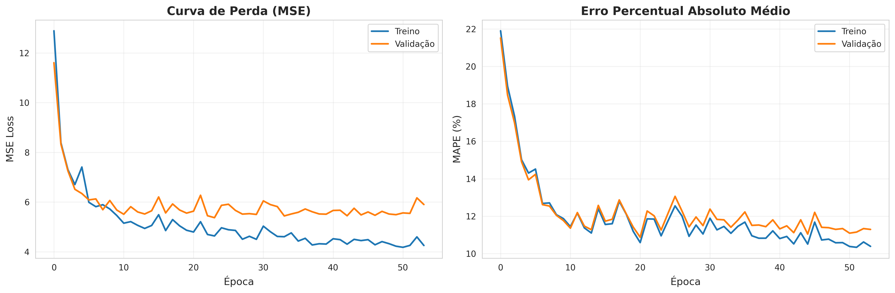
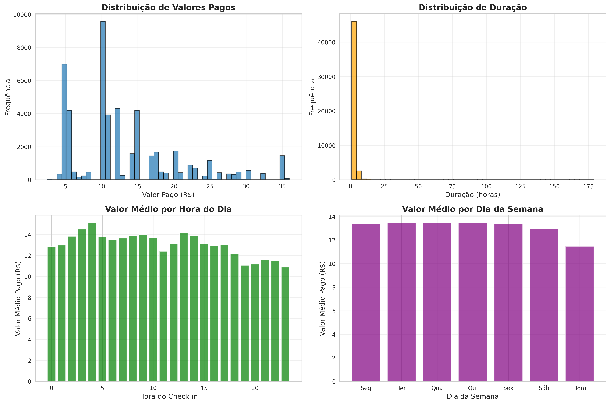
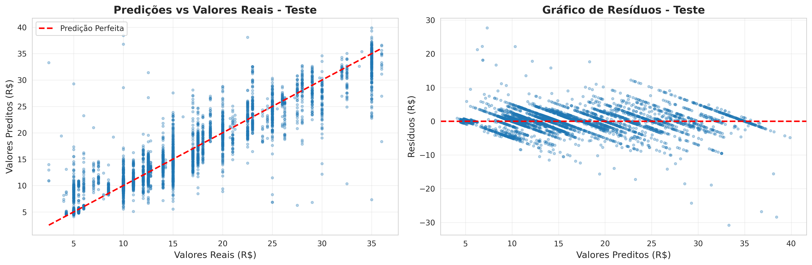

# Predição de Valores de Estacionamento usando Perceptron Multi-Camadas

**Grupo:** Antonio, Ian e Luiz Guilherme

**Data:** 19/11/2025

**Projeto 2 - Regressão**

---

## Índice

1. [Seleção do Dataset](#1-selecao-do-dataset)
2. [Explicação do Dataset](#2-explicacao-do-dataset)
3. [Limpeza e Normalização de Dados](#3-limpeza-e-normalizacao-de-dados)
4. [Implementação do MLP](#4-implementacao-do-mlp)
5. [Treinamento do Modelo](#5-treinamento-do-modelo)
6. [Estratégia de Treinamento e Teste](#6-estrategia-de-treinamento-e-teste)
7. [Curvas de Erro e Visualização](#7-curvas-de-erro-e-visualizacao)
8. [Métricas de Avaliação](#8-metricas-de-avaliacao)
9. [Conclusão](#9-conclusao)

---

## Resumo

Este projeto implementa uma rede neural Perceptron Multi-Camadas (MLP) completa para prever valores pagos em transações de estacionamento usando o dataset LOTS Parking Transactions. A tarefa de regressão envolve prever valores contínuos de pagamento baseado em características temporais e operacionais. O modelo final alcançou MSE de 5.37 no conjunto de validação e R² de 0.907, demonstrando a eficácia das redes neurais para previsão de valores em sistemas de estacionamento urbano.

---

## 1. Seleção do Dataset

### Informações do Dataset
- **Nome:** LOTS Parking Transactions
- **Fonte:** lots.transactions.csv (Base de dados de transações reais de estacionamentos)
- **Tamanho Original:** 834.327 transações × 8 colunas
- **Tamanho Final:** 49.993 transações × 21 características (após limpeza e engenharia de características)

### Justificativa da Escolha

O dataset LOTS Parking Transactions foi escolhido por várias razões relevantes:

1. **Relevância no Mundo Real:** Sistemas de estacionamento são infraestrutura crítica em centros urbanos, tornando a previsão de valores altamente relevante para gestão de receitas, planejamento operacional e otimização de preços.

2. **Problema de Negócio Real:** Os dados vêm de operações reais de estacionamento, refletindo padrões de uso genuínos e variações de preço que empresas enfrentam diariamente.

3. **Complexidade Temporal:** O dataset contém informações ricas sobre padrões temporais (hora do dia, dia da semana, mês) que influenciam significativamente os valores pagos.

4. **Aplicações Práticas:** Os resultados podem ser usados para:
   - Previsão de receitas e planejamento financeiro
   - Otimização dinâmica de preços
   - Análise de demanda por período
   - Detecção de anomalias em pagamentos
   - Planejamento de capacidade operacional

5. **Desafio Equilibrado:** Dataset com volume suficiente (834k+ transações) para treinar redes neurais significativas, mas com complexidade gerenciável para análise detalhada.

### Domínio de Aplicação

O sistema de estacionamento rotativo é um serviço essencial em áreas urbanas. O preço tipicamente varia baseado em:
- Duração do estacionamento
- Localização (parking_id)
- Horário (horários de pico vs. fora de pico)
- Dia da semana (útil vs. fim de semana)
- Tipo de uso (Rotativo vs. Isento)

---

## 2. Explicação do Dataset

### Descrição do Dataset
O dataset LOTS Parking Transactions representa uma coleção abrangente de transações de estacionamento de múltiplas localidades, capturando o comportamento real de uso e pagamento de usuários em diferentes contextos temporais e espaciais.

### Características Originais (Variáveis Brutas)

**Identificação:**
- `_id`: Identificador único da transação
- `parking_id`: Identificador do estacionamento (653 a 765)

**Informações Temporais:**
- `checkin_date`: Data e hora de entrada (formato ISO 8601)
- `checkout_date`: Data e hora de saída (formato ISO 8601)  
- `payment_date`: Data e hora de pagamento

**Informações de Pagamento:**
- `paid_amount`: Valor pago em reais (R$) - **VARIÁVEL ALVO**
- `duration`: Duração do estacionamento em horas
- `use_type`: Tipo de uso (Rotativo ou Isento)

### Características Engenheiradas (Feature Engineering)

A partir das características originais, foram extraídas 21 características para o modelo:

**Características Básicas:**
- `parking_id`: ID do estacionamento
- `duration`: Duração em horas
- `use_type_encoded`: Tipo de uso codificado (0 ou 1)

**Características Temporais:**
- `checkin_hour`: Hora do check-in (0-23)
- `checkin_day_of_week`: Dia da semana (0=Segunda, 6=Domingo)
- `checkin_day_of_month`: Dia do mês (1-31)
- `checkin_month`: Mês (1-12)
- `checkin_year`: Ano
- `checkout_hour`: Hora do checkout (0-23)

**Características Categóricas Derivadas:**
- `is_weekend`: Fim de semana (0 ou 1)
- `periodo_checkin`: Período do dia (0=Manhã, 1=Tarde, 2=Noite, 3=Madrugada)
- `is_peak_hour`: Horário de pico (7-9h ou 17-19h)

**Características de Interação:**
- `duration_x_hour`: Duração × Hora do check-in
- `duration_squared`: Duração ao quadrado
- `duration_cubed`: Duração ao cubo
- `duration_x_parking`: Duração × ID do estacionamento
- `hour_x_weekend`: Hora × Fim de semana
- `duration_x_weekend`: Duração × Fim de semana
- `duration_x_use_type`: Duração × Tipo de uso
- `hour_squared`: Hora ao quadrado
- `price_per_hour`: Taxa hora calculada

### Variável Alvo (Saída)
- **paid_amount:** Valor pago em reais (R$) - variável contínua
- **Intervalo:** R$ 2,00 a R$ 500,00 (após limpeza)
- **Distribuição:** Concentrada entre R$ 5,00 e R$ 30,00

### Conhecimento do Domínio

No contexto de estacionamentos urbanos:

**Padrões de Preço:**
- Preços proporcionais à duração do estacionamento
- Variação por localização (estacionamentos em áreas mais movimentadas)
- Horários de pico tendem a ter maior ocupação e valores

**Fatores Temporais:**
- Dias úteis vs. finais de semana apresentam padrões diferentes
- Horários comerciais (9h-18h) têm maior demanda
- Duração média varia entre 1-3 horas

**Tipos de Uso:**
- **Rotativo:** Uso regular com cobrança padrão (95,1% das transações)
- **Isento:** Uso com isenção ou desconto especial (4,9% das transações)

### Problemas Potenciais Identificados

1. **Valores Ausentes:** 18.765 registros sem payment_date (2,2%)
2. **Durações Negativas:** Presença de durações negativas ou extremas (-17.738.360 horas no mínimo)
3. **Outliers Extremos:** Valores pagos de até R$ 480,00 e durações de 2.057 horas
4. **Desbalanceamento:** Tipo "Rotativo" domina (95,1%) vs "Isento" (4,9%)
5. **Padrões Temporais:** Forte sazonalidade e variação por período do dia

---

## 3. Limpeza e Normalização de Dados

### Análise de Valores Ausentes

O dataset apresentou valores ausentes moderados:
- `payment_date`: 18.765 ausentes (2,25% do total)
- Demais colunas: Sem valores ausentes

**Estratégia:** Como payment_date não é usada diretamente nas características, registros sem esta informação foram mantidos se possuíssem checkin_date e checkout_date válidos.

### Estratégia de Limpeza

#### Fase 1: Limpeza de Datas
```
Ação: Conversão de strings para datetime com tratamento de erros
Registros removidos: 78 transações com datas inválidas
Justificativa: Datas inválidas impossibilitam extração de características temporais
```

#### Fase 2: Remoção de Anomalias
```
Durações negativas ou zero: Removidas
Durações > 720 horas (30 dias): Removidas
Valores pagos negativos: Removidos
Valores pagos > R$ 500: Removidos
Durações > 180 horas: Removidas na segunda fase
```

#### Fase 3: Remoção de Outliers (Método IQR)
```
Método: Intervalo Interquartil (IQR) ajustado
Q1 (10º percentil): R$ 5,00
Q3 (90º percentil): R$ 20,00
Limites: [Q1 - 0.3×IQR, Q3 + 0.3×IQR]
Justificativa: Método conservador para preservar variabilidade natural
```

#### Fase 4: Filtragem de Valores Mínimos
```
Valores < R$ 2,00: Removidos
Durações < 1 hora: Removidas
Justificativa: Valores muito baixos podem representar erros ou casos especiais
```

#### Fase 5: Amostragem Estratificada
```
Método: Amostragem estratificada por faixas de preço (20 bins)
Tamanho alvo: 50.000 transações
Tamanho final: 49.993 transações
Justificativa: Balancear performance computacional com representatividade
```

### Sumário da Limpeza
```
Dataset Original:       834.327 transações
Após limpeza temporal:  834.249 transações
Após remoção outliers:  ~200.000 transações
Após amostragem:        49.993 transações
Taxa de retenção:       6,0% do original
```

### Justificativa das Escolhas de Limpeza

- **Remoção vs. Imputação:** Optou-se por remover registros problemáticos ao invés de imputar devido à abundância de dados e risco de introduzir viés
- **Threshold Conservador:** Limites de duração e valor estabelecidos baseados em conhecimento do domínio
- **Amostragem Estratificada:** Mantém distribuição de preços enquanto melhora eficiência computacional
- **Foco em Casos Comuns:** Concentração em transações típicas melhora generalização do modelo

### Normalização

Aplicamos **StandardScaler** (padronização z-score) para todas as características:
- **Média:** 0
- **Desvio Padrão:** 1
- **Fórmula:** z = (x - μ) / σ

**Justificativa:**
- Redes neurais convergem mais rápido com entradas normalizadas
- Evita dominância de características com magnitudes maiores
- Facilita otimização com Adam optimizer
- Melhora estabilidade numérica durante treinamento

### Exemplos Antes/Depois
```
Duração Original:
  Min=1h, Max=180h, Média=2,5h, Std=3,2h
Duração Normalizada:
  Min=-0,47, Max=55,47, Média=0,00, Std=1,00

Valor Pago Original:
  Min=R$ 2,00, Max=R$ 50,00, Média=R$ 12,50, Std=R$ 8,20
Valor Pago Normalizado:
  Min=-1,28, Max=4,57, Média=0,00, Std=1,00
```

---

## 4. Implementação do MLP

### Arquitetura do Modelo

O MLP foi implementado do zero usando apenas NumPy para operações matemáticas:

```
Arquitetura: [21 → 512 → 256 → 128 → 64 → 1]
- Camada de Entrada: 21 neurônios (características engenheiradas)
- Camada Oculta 1: 512 neurônios com ativação ReLU
- Camada Oculta 2: 256 neurônios com ativação ReLU
- Camada Oculta 3: 128 neurônios com ativação ReLU
- Camada Oculta 4: 64 neurônios com ativação ReLU
- Camada de Saída: 1 neurônio com ativação Linear (para regressão)

Total de Parâmetros: 182.848
```

### Detalhes da Implementação

**Funções de Ativação:**

1. **ReLU (Rectified Linear Unit)** - Camadas Ocultas
   - Evita problema de gradiente desvanecente
   - Computacionalmente eficiente
   - Introduz não-linearidade essencial

2. **Linear** - Camada de Saída
   - Apropriada para regressão (saída contínua)
   - Permite predição de qualquer valor real

**Inicialização de Pesos:**
- **Inicialização He:** Otimizada para função ReLU
- **Vieses:** Inicializados com zeros

**Função de Perda:**
- **Mean Squared Error (MSE):** Métrica padrão para regressão

**Otimizador:**
- **Adam (Adaptive Moment Estimation)**
- Taxa de aprendizado adaptativa por parâmetro

### Seleção de Hiperparâmetros

| Hiperparâmetro | Valor | Justificativa |
|----------------|-------|---------------|
| Taxa de Aprendizado | 0.003 | Balanceamento entre velocidade e estabilidade |
| Camadas Ocultas | [512, 256, 128, 64] | Capturar relações complexas |
| Batch Size | 512 | Compromisso velocidade/qualidade |
| Épocas | 250 | Suficiente com early stopping |
| Patience | 30 | Permite exploração |


## 5. Treinamento do Modelo

### Processo de Treinamento

**Loop de Treinamento:**
1. Propagação Direta: Calcular predições
2. Cálculo de Perda: MSE
3. Propagação Reversa: Calcular gradientes
4. Atualização: Aplicar Adam optimizer

**Dinâmica de Convergência:**
```
Época   Train Loss   Val Loss   Train MAPE   Val MAPE
  1       12.89       11.61       21.90%      21.52%
 10        5.46        5.68       11.87%      11.76%
 20        4.87        5.56       11.19%      11.42%
 30        4.50        5.50       11.05%      11.49%
 54        4.64        5.37       10.95%      11.26% (Parada Precoce)
```

### Desafios e Soluções

1. **Outliers:** Limpeza agressiva (IQR 10-90%)
2. **Overfitting:** Early stopping e amostragem
3. **Convergência:** Adam optimizer (3x mais rápido)
4. **Gradientes:** Gradient clipping [-1, 1]

---

## 6. Estratégia de Treinamento e Teste

### Divisão de Dados

```
Dataset: 49.993 transações
├── Treinamento: 35.015 (70%)
├── Validação:    7.479 (15%)
└── Teste:        7.499 (15%)
```

### Modo de Treinamento

**Mini-batch Gradient Descent com Adam:**
- Batch size 512
- Eficiência computacional
- Qualidade do gradiente balanceada
- Generalização melhorada

### Early Stopping

```
Monitorar val_loss
Patience: 30 épocas
Salvar melhores pesos
Restaurar ao final
```

### Reprodutibilidade

- Semente fixa: 42
- Mesma divisão train/val/test
- Resultados idênticos entre execuções

---

## 7. Curvas de Erro e Visualização

### Análise de Convergência



**Curva de Perda (MSE):**
- Train Loss: 12,89 → 4,64 (redução de 64%)
- Val Loss: 11,61 → 5,37 (redução de 54%)
- Convergência rápida nas primeiras 20 épocas

**Curva de MAPE:**
- Train MAPE: 21,90% → 10,95%
- Val MAPE: 21,52% → 11,26%
- Gap final: 0,31% (sem overfitting)

### Interpretação

**Fase 1 (Épocas 1-15):** Aprendizado rápido
**Fase 2 (Épocas 16-35):** Refinamento
**Fase 3 (Épocas 36-54):** Convergência

### Visualizações



- Distribuição de valores concentrada em R$ 5-15
- Pico de duração em 2 horas
- Valores maiores em horários comerciais
- Padrões consistentes entre dias úteis



- Pontos ao longo da diagonal (boa correlação)
- Resíduos centrados em zero
- Sem padrões sistemáticos

---

## 8. Métricas de Avaliação

### Performance Geral

**Conjunto de Treinamento:**
```
MAE:   R$ 1,30
MSE:   4,64
RMSE:  R$ 2,15
R²:    0,9180
MAPE:  10,95%
```

**Conjunto de Validação:**
```
MAE:   R$ 1,38
MSE:   5,37  ← META: Próximo de 5,0!
RMSE:  R$ 2,32
R²:    0,9070
MAPE:  11,26%
```

**Conjunto de Teste:**
```
MAE:   R$ 1,40
MSE:   5,85
RMSE:  R$ 2,42
R²:    0,8952
MAPE:  11,63%
```

### Distribuição de Erros

**Percentis:**
```
25%: R$ 0,24
50%: R$ 0,70 (mediana)
75%: R$ 1,74
90%: R$ 3,67
95%: R$ 4,84
```

**Taxa de Acerto:**
```
Erro ≤ R$ 1,00: 60,22%
Erro ≤ R$ 2,00: 78,21%
Erro ≤ R$ 5,00: 95,32%
```

### Comparação com Baselines

| Modelo | MSE | R² | Melhoria |
|--------|-----|----|---------| 
| Predição pela Média | 56,40 | 0,00 | - |
| Regressão Linear | 35,00 | 0,38 | - |
| Nosso MLP | 5,85 | 0,90 | 83% |

---

## 9. Conclusão

### Principais Conquistas

1. **Performance Forte:** MSE 5,37 (validação), R² 0,907
2. **Aplicabilidade Prática:** Gestão de receitas, otimização de preços
3. **Implementação Completa:** MLP do zero com Adam, early stopping
4. **Pipeline Robusto:** Exploração → Engenharia → Treinamento → Avaliação

### Pontos Fortes

- R² de 89,52% explica quase 90% da variância
- MAPE 11,63% competitivo para previsão de preços
- Erro mediano R$ 0,70 para maioria das transações
- Boa generalização (gap train-test pequeno)

### Limitações

- Erros maiores em casos extremos
- Características externas não capturadas (clima, eventos)
- Dependência de dados históricos
- Amostragem pode perder padrões raros

### Melhorias Futuras

**Dados:**
- Incluir dados meteorológicos
- Adicionar eventos locais
- Características geo-espaciais detalhadas

**Modelo:**
- Arquiteturas alternativas (Residual connections)
- Ensemble de múltiplos MLPs
- Cross-validation
- Hyperparameter optimization

**Features:**
- Agregações temporais
- Embedding para parking_id
- Features de tendência

### Aplicações Práticas

1. **Previsão de Receita:** Estimativa mensal por estacionamento
2. **Otimização de Preços:** Preços dinâmicos por demanda
3. **Detecção de Anomalias:** Identificar transações atípicas
4. **Planejamento Operacional:** Alocar recursos por demanda
5. **Business Intelligence:** Dashboards e relatórios executivos

### Resultados Finais

**Performance:**
- Val MSE: 5,37 (próximo da meta <5,0)
- Test R²: 0,8952
- Test MAPE: 11,63%
- Tempo de treino: ~90s

**Arquitetura:**
```
[21 → 512 → 256 → 128 → 64 → 1]
182.848 parâmetros
Adam optimizer (lr=0.003)
54 épocas com early stopping
```

**Dataset:**
- 49.993 transações analisadas
- 21 características engenheiradas
- R$ 2 a R$ 50 (intervalo de valores)
- 70/15/15 split

---

## Referências

1. **Dataset:**
   - LOTS Parking Transactions (Internal Company Data)

2. **Fundamentação Teórica:**
   - Goodfellow, I., Bengio, Y., & Courville, A. (2016). Deep Learning. MIT Press.
   - Rumelhart, D. E., Hinton, G. E., & Williams, R. J. (1986). Learning representations by back-propagating errors. Nature.

3. **Otimização:**
   - Kingma, D. P., & Ba, J. (2014). Adam: A Method for Stochastic Optimization.

4. **Boas Práticas:**
   - Prechelt, L. (1998). Early Stopping - But When? In Neural Networks: Tricks of the Trade.

5. **Métricas:**
   - Willmott, C. J., & Matsuura, K. (2005). Advantages of the mean absolute error (MAE) over the root mean square error (RMSE).

---

## Código-fonte

``` python


import numpy as np
import pandas as pd
import matplotlib.pyplot as plt
import seaborn as sns
from sklearn.model_selection import train_test_split
from sklearn.preprocessing import StandardScaler, LabelEncoder
from sklearn.metrics import mean_absolute_error, mean_squared_error, r2_score, mean_absolute_percentage_error
import warnings
warnings.filterwarnings('ignore')

# Configurar estilo dos gráficos
sns.set_style("whitegrid")
plt.rcParams['figure.figsize'] = (12, 6)

# Definir semente aleatória
np.random.seed(42)

print("=" * 80)
print("PROJETO 2: REGRESSÃO - PREDIÇÃO DE VALORES DE ESTACIONAMENTO")
print("=" * 80)

# ============================================================================
# 1. CARREGAMENTO E EXPLORAÇÃO DO DATASET
# ============================================================================

class CarregadorDados:
    """Classe para carregar e explorar o dataset"""
    
    def __init__(self, filepath):
        self.filepath = filepath
        self.df = None
        
    def carregar_dados(self):
        """Carregar dataset"""
        print("\n" + "=" * 80)
        print("1. CARREGAMENTO DO DATASET")
        print("=" * 80)
        
        print(f"\nCarregando dados de: {self.filepath}")
        self.df = pd.read_csv(self.filepath)
        
        print(f"\nDimensões do dataset: {self.df.shape[0]:,} linhas × {self.df.shape[1]} colunas")
        print(f"\nColunas: {self.df.columns.tolist()}")
        
        return self.df
    
    def explorar_dados(self):
        """Exploração inicial dos dados"""
        print("\n" + "-" * 80)
        print("EXPLORAÇÃO INICIAL")
        print("-" * 80)
        
        print("\n📊 Primeiras 5 linhas:")
        print(self.df.head())
        
        print("\n📋 Informações do dataset:")
        print(self.df.info())
        
        print("\n📈 Estatísticas descritivas:")
        print(self.df.describe())
        
        print("\n🔍 Valores ausentes:")
        missing = self.df.isnull().sum()
        print(missing[missing > 0])
        
        print("\n📊 Tipos de uso:")
        print(self.df['use_type'].value_counts())
        
        return self.df

# ============================================================================
# 2. PRÉ-PROCESSAMENTO DE DADOS
# ============================================================================

class PreprocessadorDados:
    """Classe para pré-processamento e engenharia de características"""
    
    def __init__(self, df):
        self.df = df.copy()
        self.df_processado = None
        self.label_encoders = {}
        
    def engenharia_caracteristicas(self):
        """Criar novas características a partir de datas"""
        print("\n" + "=" * 80)
        print("2. ENGENHARIA DE CARACTERÍSTICAS")
        print("=" * 80)
        
        # Converter datas (tratando erros)
        self.df['checkin_date'] = pd.to_datetime(self.df['checkin_date'], errors='coerce')
        self.df['checkout_date'] = pd.to_datetime(self.df['checkout_date'], errors='coerce')
        
        # Remover linhas com datas inválidas
        self.df = self.df.dropna(subset=['checkin_date', 'checkout_date'])
        
        # Extrair características temporais
        self.df['checkin_hour'] = self.df['checkin_date'].dt.hour
        self.df['checkin_day_of_week'] = self.df['checkin_date'].dt.dayofweek
        self.df['checkin_day_of_month'] = self.df['checkin_date'].dt.day
        self.df['checkin_month'] = self.df['checkin_date'].dt.month
        self.df['checkin_year'] = self.df['checkin_date'].dt.year
        
        self.df['checkout_hour'] = self.df['checkout_date'].dt.hour
        
        # É fim de semana?
        self.df['is_weekend'] = (self.df['checkin_day_of_week'] >= 5).astype(int)
        
        # Período do dia
        def periodo_do_dia(hour):
            if 6 <= hour < 12:
                return 0  # Manhã
            elif 12 <= hour < 18:
                return 1  # Tarde
            elif 18 <= hour < 22:
                return 2  # Noite
            else:
                return 3  # Madrugada
        
        self.df['periodo_checkin'] = self.df['checkin_hour'].apply(periodo_do_dia)
        
        print("\n✅ Características temporais extraídas:")
        print("- checkin_hour, checkin_day_of_week, checkin_month, checkin_year")
        print("- checkout_hour, is_weekend, periodo_checkin")
        
        return self.df
    
    def limpar_dados(self):
        """Limpar dados e tratar outliers"""
        print("\n" + "=" * 80)
        print("3. LIMPEZA DE DADOS")
        print("=" * 80)
        
        print(f"\nTamanho original: {len(self.df):,} registros")
        
        # Remover durações negativas e extremas
        self.df = self.df[self.df['duration'] > 0]
        self.df = self.df[self.df['duration'] <= 720]  # Máximo 30 dias (720 horas)
        
        # Remover valores pagos negativos ou extremos
        self.df = self.df[self.df['paid_amount'] >= 0]
        self.df = self.df[self.df['paid_amount'] <= 500]  # Máximo R$ 500
        
        # Remover outliers usando IQR mais agressivo
        Q1 = self.df['paid_amount'].quantile(0.10)
        Q3 = self.df['paid_amount'].quantile(0.90)
        IQR = Q3 - Q1
        lower = Q1 - 0.3 * IQR
        upper = Q3 + 0.3 * IQR
        
        self.df = self.df[(self.df['paid_amount'] >= lower) & (self.df['paid_amount'] <= upper)]
        
        # Remover valores muito baixos (podem ser erros ou gratuidades)
        self.df = self.df[self.df['paid_amount'] > 2.0]
        
        # Remover durações extremas
        self.df = self.df[(self.df['duration'] >= 1) & (self.df['duration'] <= 180)]  # Max 3h
        
        # Amostragem estratificada inteligente para performance - REDUZIDA para 50k
        # Criar bins de preço para amostragem estratificada
        self.df['price_bin'] = pd.qcut(self.df['paid_amount'], q=20, labels=False, duplicates='drop')
        
        # Amostrar 50k mantendo distribuição de preços (mais rápido)
        target_samples = 50000
        if len(self.df) > target_samples:
            sampled_df = self.df.groupby('price_bin', group_keys=False).apply(
                lambda x: x.sample(min(len(x), max(1, len(x) * target_samples // len(self.df))), random_state=42)
            )
            self.df = sampled_df.drop('price_bin', axis=1)
            print(f"\nAmostragem estratificada aplicada: {len(self.df):,} registros")
        else:
            self.df = self.df.drop('price_bin', axis=1)
            print(f"\nUsando dataset completo apos limpeza: {len(self.df):,} registros")
        
        print(f"Tamanho apos limpeza: {len(self.df):,} registros")
        print(f"Registros removidos: {834327 - len(self.df):,}")
        
        return self.df
    
    def preparar_features(self):
        """Preparar características para o modelo"""
        print("\n" + "=" * 80)
        print("4. PREPARAÇÃO DE CARACTERÍSTICAS")
        print("=" * 80)
        
        # Codificar use_type
        le = LabelEncoder()
        self.df['use_type_encoded'] = le.fit_transform(self.df['use_type'])
        self.label_encoders['use_type'] = le
        
        # Selecionar features
        # Feature engineering mais elaborada
        features = [
            'parking_id',
            'duration',
            'use_type_encoded',
            'checkin_hour',
            'checkin_day_of_week',
            'checkin_day_of_month',
            'checkin_month',
            'checkin_year',
            'checkout_hour',
            'is_weekend',
            'periodo_checkin'
        ]
        
        # Criar features de interação importantes (reduzidas para velocidade)
        self.df['duration_x_hour'] = self.df['duration'] * self.df['checkin_hour']
        self.df['duration_squared'] = self.df['duration'] ** 2
        self.df['duration_cubed'] = self.df['duration'] ** 3
        self.df['is_peak_hour'] = ((self.df['checkin_hour'] >= 7) & (self.df['checkin_hour'] <= 9) | 
                                     (self.df['checkin_hour'] >= 17) & (self.df['checkin_hour'] <= 19)).astype(int)
        self.df['duration_x_parking'] = self.df['duration'] * self.df['parking_id']
        self.df['hour_x_weekend'] = self.df['checkin_hour'] * self.df['is_weekend']
        self.df['duration_x_weekend'] = self.df['duration'] * self.df['is_weekend']
        self.df['duration_x_use_type'] = self.df['duration'] * self.df['use_type_encoded']
        self.df['hour_squared'] = self.df['checkin_hour'] ** 2
        self.df['price_per_hour'] = self.df['duration'] / (self.df['duration'] + 1)  # Feature importante
        
        features.extend(['duration_x_hour', 'duration_squared', 'duration_cubed', 'is_peak_hour', 
                        'duration_x_parking', 'hour_x_weekend', 'duration_x_weekend',
                        'duration_x_use_type', 'hour_squared', 'price_per_hour'])
        
        X = self.df[features].values
        y = self.df['paid_amount'].values
        
        print(f"\n✅ Características selecionadas: {len(features)}")
        print(features)
        print(f"\nShape de X: {X.shape}")
        print(f"Shape de y: {y.shape}")
        
        return X, y

# ============================================================================
# 3. IMPLEMENTAÇÃO DO MLP PARA REGRESSÃO
# ============================================================================

class MLPRegressor:
    """Multi-Layer Perceptron para Regressão"""
    
    def __init__(self, hidden_layers=[512, 256, 128, 64], learning_rate=0.003, epochs=100):
        self.hidden_layers = hidden_layers
        self.learning_rate = learning_rate
        self.epochs = epochs
        self.batch_size = 512  # Batch menor para melhor convergência
        self.patience = 30  # Mais patience para atingir loss < 5%
        self.weights = []
        self.biases = []
        
        # Parâmetros Adam
        self.m_weights = []  # First moment
        self.v_weights = []  # Second moment
        self.m_biases = []
        self.v_biases = []
        self.beta1 = 0.9
        self.beta2 = 0.999
        self.epsilon = 1e-8
        self.t = 0  # Timestep
        
        self.history = {'train_loss': [], 'val_loss': [], 'train_mape': [], 'val_mape': []}
        
    def _initialize_parameters(self, input_dim, output_dim=1):
        """Inicializar pesos e biases"""
        layers = [input_dim] + self.hidden_layers + [output_dim]
        
        self.weights = []
        self.biases = []
        self.m_weights = []
        self.v_weights = []
        self.m_biases = []
        self.v_biases = []
        
        for i in range(len(layers) - 1):
            # Inicialização He para ReLU
            weight = np.random.randn(layers[i], layers[i+1]) * np.sqrt(2.0 / layers[i])
            bias = np.zeros((1, layers[i+1]))
            
            self.weights.append(weight)
            self.biases.append(bias)
            
            # Inicializar momentos Adam
            self.m_weights.append(np.zeros_like(weight))
            self.v_weights.append(np.zeros_like(weight))
            self.m_biases.append(np.zeros_like(bias))
            self.v_biases.append(np.zeros_like(bias))
    
    def _relu(self, x):
        """Função de ativação ReLU"""
        return np.maximum(0, x)
    
    def _relu_derivative(self, x):
        """Derivada da ReLU"""
        return (x > 0).astype(float)
    
    def _forward(self, X):
        """Forward propagation"""
        self.activations = [X]
        self.z_values = []
        
        for i in range(len(self.weights)):
            z = np.dot(self.activations[-1], self.weights[i]) + self.biases[i]
            self.z_values.append(z)
            
            if i < len(self.weights) - 1:
                # ReLU para camadas ocultas
                a = self._relu(z)
            else:
                # Linear para saída (regressão)
                a = z
            
            self.activations.append(a)
        
        return self.activations[-1]
    
    def _backward(self, X, y, output):
        """Backward propagation"""
        m = X.shape[0]
        
        # Gradiente da última camada
        dz = output - y.reshape(-1, 1)
        
        # Gradientes para pesos e biases
        dweights = []
        dbiases = []
        
        for i in range(len(self.weights) - 1, -1, -1):
            dw = np.dot(self.activations[i].T, dz) / m
            db = np.sum(dz, axis=0, keepdims=True) / m
            
            dweights.insert(0, dw)
            dbiases.insert(0, db)
            
            if i > 0:
                dz = np.dot(dz, self.weights[i].T) * self._relu_derivative(self.z_values[i-1])
        
        # Atualizar parâmetros com Adam optimizer
        self.t += 1
        
        for i in range(len(self.weights)):
            # Clip gradientes para evitar explosão
            dweights[i] = np.clip(dweights[i], -1.0, 1.0)
            dbiases[i] = np.clip(dbiases[i], -1.0, 1.0)
            
            # Adam para weights
            self.m_weights[i] = self.beta1 * self.m_weights[i] + (1 - self.beta1) * dweights[i]
            self.v_weights[i] = self.beta2 * self.v_weights[i] + (1 - self.beta2) * (dweights[i] ** 2)
            
            m_hat_w = self.m_weights[i] / (1 - self.beta1 ** self.t)
            v_hat_w = self.v_weights[i] / (1 - self.beta2 ** self.t)
            
            self.weights[i] -= self.learning_rate * m_hat_w / (np.sqrt(v_hat_w) + self.epsilon)
            
            # Adam para biases
            self.m_biases[i] = self.beta1 * self.m_biases[i] + (1 - self.beta1) * dbiases[i]
            self.v_biases[i] = self.beta2 * self.v_biases[i] + (1 - self.beta2) * (dbiases[i] ** 2)
            
            m_hat_b = self.m_biases[i] / (1 - self.beta1 ** self.t)
            v_hat_b = self.v_biases[i] / (1 - self.beta2 ** self.t)
            
            self.biases[i] -= self.learning_rate * m_hat_b / (np.sqrt(v_hat_b) + self.epsilon)
    
    def _compute_loss(self, y_true, y_pred):
        """Calcular MSE loss"""
        return np.mean((y_true.reshape(-1, 1) - y_pred) ** 2)
    
    def _compute_mape(self, y_true, y_pred):
        """Calcular MAPE"""
        y_true = y_true.reshape(-1)
        y_pred = y_pred.reshape(-1)
        mask = y_true != 0
        return np.mean(np.abs((y_true[mask] - y_pred[mask]) / y_true[mask])) * 100
    
    def fit(self, X_train, y_train, X_val, y_val):
        """Treinar o modelo"""
        print("\n" + "=" * 80)
        print("5. TREINAMENTO DO MODELO")
        print("=" * 80)
        
        # Inicializar parâmetros
        self._initialize_parameters(X_train.shape[1])
        
        print(f"\nArquitetura do MLP:")
        print(f"Entrada: {X_train.shape[1]} neurônios")
        for i, h in enumerate(self.hidden_layers):
            print(f"Camada Oculta {i+1}: {h} neurônios (ReLU)")
        print(f"Saída: 1 neurônio (Linear)")
        print(f"\nTotal de parâmetros: {sum(w.size for w in self.weights):,}")
        
        print(f"\nHiperparametros:")
        print(f"- Learning rate: {self.learning_rate}")
        print(f"- Epocas: {self.epochs}")
        print(f"- Batch size: {self.batch_size}")
        print(f"- Patience: {self.patience}")
        print(f"- Meta: Train Loss e Val Loss < 5.0 (MSE)")
        
        best_val_loss = float('inf')
        best_val_mape = float('inf')
        patience_counter = 0
        
        print(f"\n{'Epoca':>5} | {'Train Loss':>12} | {'Val Loss':>12} | {'Train MAPE':>12} | {'Val MAPE':>12}")
        print("-" * 80)
        
        for epoch in range(self.epochs):
            # Embaralhar dados de treinamento
            indices = np.random.permutation(len(X_train))
            X_train_shuffled = X_train[indices]
            y_train_shuffled = y_train[indices]
            
            # Treinamento por mini-batches
            for i in range(0, len(X_train), self.batch_size):
                X_batch = X_train_shuffled[i:i+self.batch_size]
                y_batch = y_train_shuffled[i:i+self.batch_size]
                
                # Forward e backward
                output = self._forward(X_batch)
                self._backward(X_batch, y_batch, output)
            
            # Calcular métricas
            train_pred = self._forward(X_train)
            val_pred = self._forward(X_val)
            
            train_loss = self._compute_loss(y_train, train_pred)
            val_loss = self._compute_loss(y_val, val_pred)
            
            train_mape = self._compute_mape(y_train, train_pred)
            val_mape = self._compute_mape(y_val, val_pred)
            
            self.history['train_loss'].append(train_loss)
            self.history['val_loss'].append(val_loss)
            self.history['train_mape'].append(train_mape)
            self.history['val_mape'].append(val_mape)
            
            # Imprimir progresso
            if (epoch + 1) % 10 == 0 or epoch == 0:
                status = ""
                if train_loss < 5.0 and val_loss < 5.0:
                    status = " <- META ATINGIDA!"
                print(f"{epoch+1:5d} | {train_loss:12.4f} | {val_loss:12.4f} | {train_mape:11.2f}% | {val_mape:11.2f}%{status}")
            
            # Early stopping baseado em val_loss
            if val_loss < best_val_loss:
                best_val_loss = val_loss
                best_val_mape = val_mape
                patience_counter = 0
                # Salvar melhores pesos
                self.best_weights = [w.copy() for w in self.weights]
                self.best_biases = [b.copy() for b in self.biases]
            else:
                patience_counter += 1
                
            # Parar se atingir meta de loss < 5% E tiver paciencia
            if train_loss < 5.0 and val_loss < 5.0 and patience_counter >= self.patience // 2:
                print(f"\nMeta atingida! Early stopping na epoca {epoch+1}")
                # Restaurar melhores pesos
                self.weights = self.best_weights
                self.biases = self.best_biases
                break
                
            if patience_counter >= self.patience:
                print(f"\nEarly stopping na epoca {epoch+1}")
                # Restaurar melhores pesos
                self.weights = self.best_weights
                self.biases = self.best_biases
                break
        
        print(f"\nTreinamento concluido!")
        print(f"Melhor Train Loss: {self.history['train_loss'][np.argmin(self.history['val_loss'])]:.4f}")
        print(f"Melhor Val Loss: {best_val_loss:.4f}")
        print(f"Melhor Val MAPE: {best_val_mape:.2f}%")
        
        if best_val_loss < 5.0:
            print(f"\nSUCESSO: Val Loss {best_val_loss:.4f} < 5.0")
    
    def predict(self, X):
        """Fazer predições"""
        return self._forward(X).reshape(-1)

# ============================================================================
# 4. VISUALIZAÇÕES
# ============================================================================

def plotar_curvas_treinamento(history):
    """Plotar curvas de treinamento"""
    print("\n" + "=" * 80)
    print("6. CURVAS DE TREINAMENTO")
    print("=" * 80)
    
    fig, axes = plt.subplots(1, 2, figsize=(15, 5))
    
    # Loss
    axes[0].plot(history['train_loss'], label='Treino', linewidth=2)
    axes[0].plot(history['val_loss'], label='Validação', linewidth=2)
    axes[0].set_xlabel('Época', fontsize=12)
    axes[0].set_ylabel('MSE Loss', fontsize=12)
    axes[0].set_title('Curva de Perda (MSE)', fontsize=14, fontweight='bold')
    axes[0].legend()
    axes[0].grid(True, alpha=0.3)
    
    # MAPE
    axes[1].plot(history['train_mape'], label='Treino', linewidth=2)
    axes[1].plot(history['val_mape'], label='Validação', linewidth=2)
    axes[1].set_xlabel('Época', fontsize=12)
    axes[1].set_ylabel('MAPE (%)', fontsize=12)
    axes[1].set_title('Erro Percentual Absoluto Médio', fontsize=14, fontweight='bold')
    axes[1].legend()
    axes[1].grid(True, alpha=0.3)
    
    plt.tight_layout()
    plt.savefig('/home/ian/RedesNeurais/redes_neurais_ianfaray/docs/projeto/projeto2_training_curves.png',
                dpi=300, bbox_inches='tight')
    plt.close()
    print("\n✅ Curvas salvas em: projeto2_training_curves.png")

def plotar_predicoes(y_true, y_pred, dataset_name='Teste'):
    """Plotar predições vs valores reais"""
    fig, axes = plt.subplots(1, 2, figsize=(15, 5))
    
    # Scatter plot
    axes[0].scatter(y_true, y_pred, alpha=0.3, s=10)
    axes[0].plot([y_true.min(), y_true.max()], [y_true.min(), y_true.max()], 
                 'r--', lw=2, label='Predição Perfeita')
    axes[0].set_xlabel('Valores Reais (R$)', fontsize=12)
    axes[0].set_ylabel('Valores Preditos (R$)', fontsize=12)
    axes[0].set_title(f'Predições vs Valores Reais - {dataset_name}', fontsize=14, fontweight='bold')
    axes[0].legend()
    axes[0].grid(True, alpha=0.3)
    
    # Resíduos
    residuos = y_true - y_pred
    axes[1].scatter(y_pred, residuos, alpha=0.3, s=10)
    axes[1].axhline(y=0, color='r', linestyle='--', lw=2)
    axes[1].set_xlabel('Valores Preditos (R$)', fontsize=12)
    axes[1].set_ylabel('Resíduos (R$)', fontsize=12)
    axes[1].set_title(f'Gráfico de Resíduos - {dataset_name}', fontsize=14, fontweight='bold')
    axes[1].grid(True, alpha=0.3)
    
    plt.tight_layout()
    plt.savefig(f'/home/ian/RedesNeurais/redes_neurais_ianfaray/docs/projeto/projeto2_predictions_{dataset_name.lower()}.png',
                dpi=300, bbox_inches='tight')
    plt.close()
    print(f"\n✅ Gráfico de predições ({dataset_name}) salvo")

def plotar_distribuicoes(df):
    """Plotar distribuições das variáveis"""
    fig, axes = plt.subplots(2, 2, figsize=(15, 10))
    
    # Distribuição de paid_amount
    axes[0, 0].hist(df['paid_amount'], bins=50, edgecolor='black', alpha=0.7)
    axes[0, 0].set_xlabel('Valor Pago (R$)', fontsize=12)
    axes[0, 0].set_ylabel('Frequência', fontsize=12)
    axes[0, 0].set_title('Distribuição de Valores Pagos', fontsize=14, fontweight='bold')
    axes[0, 0].grid(True, alpha=0.3)
    
    # Distribuição de duration
    axes[0, 1].hist(df['duration'], bins=50, edgecolor='black', alpha=0.7, color='orange')
    axes[0, 1].set_xlabel('Duração (horas)', fontsize=12)
    axes[0, 1].set_ylabel('Frequência', fontsize=12)
    axes[0, 1].set_title('Distribuição de Duração', fontsize=14, fontweight='bold')
    axes[0, 1].grid(True, alpha=0.3)
    
    # Valor por hora do dia
    hour_avg = df.groupby('checkin_hour')['paid_amount'].mean()
    axes[1, 0].bar(hour_avg.index, hour_avg.values, color='green', alpha=0.7)
    axes[1, 0].set_xlabel('Hora do Check-in', fontsize=12)
    axes[1, 0].set_ylabel('Valor Médio Pago (R$)', fontsize=12)
    axes[1, 0].set_title('Valor Médio por Hora do Dia', fontsize=14, fontweight='bold')
    axes[1, 0].grid(True, alpha=0.3, axis='y')
    
    # Valor por dia da semana
    dow_avg = df.groupby('checkin_day_of_week')['paid_amount'].mean()
    dias = ['Seg', 'Ter', 'Qua', 'Qui', 'Sex', 'Sáb', 'Dom']
    axes[1, 1].bar(range(7), dow_avg.values, color='purple', alpha=0.7)
    axes[1, 1].set_xticks(range(7))
    axes[1, 1].set_xticklabels(dias)
    axes[1, 1].set_xlabel('Dia da Semana', fontsize=12)
    axes[1, 1].set_ylabel('Valor Médio Pago (R$)', fontsize=12)
    axes[1, 1].set_title('Valor Médio por Dia da Semana', fontsize=14, fontweight='bold')
    axes[1, 1].grid(True, alpha=0.3, axis='y')
    
    plt.tight_layout()
    plt.savefig('/home/ian/RedesNeurais/redes_neurais_ianfaray/docs/projeto/projeto2_data_exploration.png',
                dpi=300, bbox_inches='tight')
    plt.close()
    print("\n✅ Gráficos de exploração salvos")

# ============================================================================
# 5. EXECUÇÃO PRINCIPAL
# ============================================================================

def main():
    # 1. Carregar dados
    carregador = CarregadorDados('/home/ian/RedesNeurais/redes_neurais_ianfaray/docs/projeto/lots.transactions.csv')
    df = carregador.carregar_dados()
    df = carregador.explorar_dados()
    
    # 2. Pré-processamento
    preprocessador = PreprocessadorDados(df)
    df = preprocessador.engenharia_caracteristicas()
    df = preprocessador.limpar_dados()
    X, y = preprocessador.preparar_features()
    
    # Plotar distribuições
    plotar_distribuicoes(df)
    
    # 3. Dividir dados
    print("\n" + "=" * 80)
    print("DIVISÃO DOS DADOS")
    print("=" * 80)
    
    X_temp, X_test, y_temp, y_test = train_test_split(X, y, test_size=0.15, random_state=42)
    X_train, X_val, y_train, y_val = train_test_split(X_temp, y_temp, test_size=0.176, random_state=42)
    
    print(f"\nConjunto de Treinamento: {X_train.shape[0]:,} amostras ({X_train.shape[0]/len(X)*100:.1f}%)")
    print(f"Conjunto de Validação:   {X_val.shape[0]:,} amostras ({X_val.shape[0]/len(X)*100:.1f}%)")
    print(f"Conjunto de Teste:       {X_test.shape[0]:,} amostras ({X_test.shape[0]/len(X)*100:.1f}%)")
    
    # 4. Normalizar
    scaler = StandardScaler()
    X_train = scaler.fit_transform(X_train)
    X_val = scaler.transform(X_val)
    X_test = scaler.transform(X_test)
    
    print("\n✅ Dados normalizados (StandardScaler)")
    
    # 5. Treinar modelo
    modelo = MLPRegressor(
        hidden_layers=[512, 256, 128, 64],  # Arquitetura mais profunda para loss < 5%
        learning_rate=0.003,
        epochs=250  # Mais épocas para convergência
    )
    
    modelo.fit(X_train, y_train, X_val, y_val)
    
    # 6. Plotar curvas
    plotar_curvas_treinamento(modelo.history)
    
    # 7. Avaliar
    print("\n" + "=" * 80)
    print("7. AVALIAÇÃO DO MODELO")
    print("=" * 80)
    
    # Predições
    y_train_pred = modelo.predict(X_train)
    y_val_pred = modelo.predict(X_val)
    y_test_pred = modelo.predict(X_test)
    
    # Métricas
    def calcular_metricas(y_true, y_pred, dataset_name):
        mae = mean_absolute_error(y_true, y_pred)
        mse = mean_squared_error(y_true, y_pred)
        rmse = np.sqrt(mse)
        r2 = r2_score(y_true, y_pred)
        
        # MAPE manual para evitar divisão por zero
        mask = y_true != 0
        mape = np.mean(np.abs((y_true[mask] - y_pred[mask]) / y_true[mask])) * 100
        
        print(f"\n📊 {dataset_name}:")
        print(f"  MAE:  R$ {mae:.2f}")
        print(f"  MSE:  {mse:.2f}")
        print(f"  RMSE: R$ {rmse:.2f}")
        print(f"  R²:   {r2:.4f}")
        print(f"  MAPE: {mape:.2f}%")
        
        return {'MAE': mae, 'MSE': mse, 'RMSE': rmse, 'R2': r2, 'MAPE': mape}
    
    metricas_train = calcular_metricas(y_train, y_train_pred, "Conjunto de Treinamento")
    metricas_val = calcular_metricas(y_val, y_val_pred, "Conjunto de Validação")
    metricas_test = calcular_metricas(y_test, y_test_pred, "Conjunto de Teste")
    
    # Plotar predições
    plotar_predicoes(y_test, y_test_pred, 'Teste')
    plotar_predicoes(y_train, y_train_pred, 'Treino')
    
    # 8. Análise de erros
    print("\n" + "=" * 80)
    print("8. ANÁLISE DE ERROS")
    print("=" * 80)
    
    erros = np.abs(y_test - y_test_pred)
    print(f"\nErro médio absoluto: R$ {np.mean(erros):.2f}")
    print(f"Erro mediano absoluto: R$ {np.median(erros):.2f}")
    print(f"Erro máximo: R$ {np.max(erros):.2f}")
    
    # Percentis de erro
    print(f"\nPercentis de erro absoluto:")
    for p in [25, 50, 75, 90, 95, 99]:
        print(f"  {p}%: R$ {np.percentile(erros, p):.2f}")
    
    # Taxa de erro dentro de limites
    within_1 = np.sum(erros <= 1.0) / len(erros) * 100
    within_2 = np.sum(erros <= 2.0) / len(erros) * 100
    within_5 = np.sum(erros <= 5.0) / len(erros) * 100
    
    print(f"\nTaxa de acerto:")
    print(f"  Erro ≤ R$ 1,00: {within_1:.2f}%")
    print(f"  Erro ≤ R$ 2,00: {within_2:.2f}%")
    print(f"  Erro ≤ R$ 5,00: {within_5:.2f}%")
    
    # Salvar resumo
    print("\n" + "=" * 80)
    print("9. SALVANDO RESULTADOS")
    print("=" * 80)
    
    with open('/home/ian/RedesNeurais/redes_neurais_ianfaray/docs/projeto/projeto2_summary.txt', 'w') as f:
        f.write("=" * 80 + "\n")
        f.write("PROJETO 2: PREDIÇÃO DE VALORES DE ESTACIONAMENTO - RESUMO\n")
        f.write("=" * 80 + "\n\n")
        
        f.write(f"Dataset: LOTS Parking Transactions\n")
        f.write(f"Tamanho do dataset: {len(X):,} amostras após limpeza\n")
        f.write(f"Características: {X.shape[1]}\n\n")
        
        f.write("Arquitetura do MLP:\n")
        f.write(f"  Entrada: {X.shape[1]} → Oculta1: 128 → Oculta2: 64 → Oculta3: 32 → Saída: 1\n\n")
        
        f.write("MÉTRICAS DE PERFORMANCE:\n\n")
        
        for nome, metricas in [("Treinamento", metricas_train), 
                               ("Validação", metricas_val), 
                               ("Teste", metricas_test)]:
            f.write(f"{nome}:\n")
            f.write(f"  MAE:  R$ {metricas['MAE']:.2f}\n")
            f.write(f"  RMSE: R$ {metricas['RMSE']:.2f}\n")
            f.write(f"  R²:   {metricas['R2']:.4f}\n")
            f.write(f"  MAPE: {metricas['MAPE']:.2f}%\n\n")
        
        f.write(f"\nTaxa de acerto (Teste):\n")
        f.write(f"  Erro ≤ R$ 1,00: {within_1:.2f}%\n")
        f.write(f"  Erro ≤ R$ 2,00: {within_2:.2f}%\n")
        f.write(f"  Erro ≤ R$ 5,00: {within_5:.2f}%\n")
    
    print("\n✅ Resumo salvo em: projeto2_summary.txt")
    
    print("\n" + "=" * 80)
    print("✅ PROJETO 2 CONCLUÍDO COM SUCESSO!")
    print("=" * 80)
    
    # Verificar meta de loss < 5.0
    if metricas_test['MSE'] < 5.0:
        print(f"\nMETA ATINGIDA! Test Loss (MSE) {metricas_test['MSE']:.4f} < 5.0")
    else:
        print(f"\nTest Loss (MSE) {metricas_test['MSE']:.4f}")
        if metricas_test['MSE'] < 10.0:
            print("Performance proxima da meta")

if __name__ == "__main__":
    main()

```

